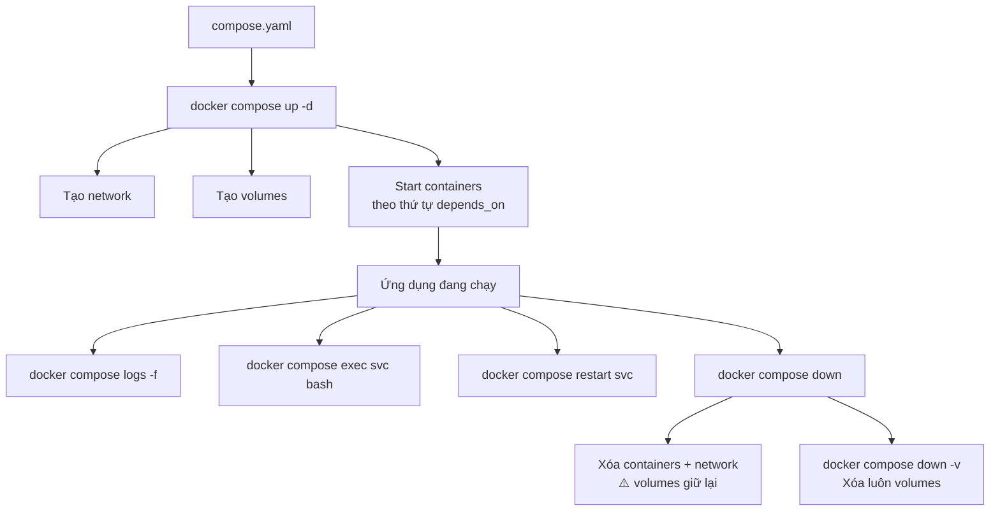
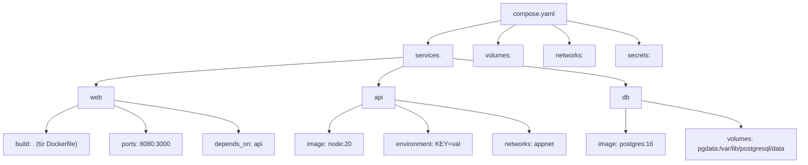

# Docker Compose — Cheat Sheet

> Chạy nhiều container cùng nhau được định nghĩa trong file `compose.yaml`.  
> Dùng cho **local development** và **staging**. Với production multi-host → xem [README-swarm.md](README-swarm.md).  
> Xem thêm: [README.md](README.md) (index) · [README-core.md](README-core.md) · [README-dockerfile.md](README-dockerfile.md)

---

## Flow hoạt động



---

## Lệnh thường dùng

| Lệnh | Mô tả |
|------|-------|
| `docker compose up -d` | Khởi động tất cả service (chạy ngầm) |
| `docker compose up -d --build` | Build lại image trước rồi mới start |
| `docker compose down` | Dừng và xóa containers + network |
| `docker compose down -v` | Dừng và xóa luôn volumes |
| `docker compose ps` | Xem trạng thái các service |
| `docker compose logs -f <svc>` | Xem log real-time của 1 service (bỏ `<svc>` để xem tất cả) |
| `docker compose exec <svc> bash` | Mở shell vào service đang chạy |
| `docker compose restart <svc>` | Restart 1 service |
| `docker compose stop <svc>` | Dừng service (giữ container) |
| `docker compose start <svc>` | Khởi động lại container đã dừng |

## Lệnh ít dùng hơn

| Lệnh | Mô tả |
|------|-------|
| `docker compose build` | Build image mà không start |
| `docker compose pull` | Pull image mới nhất cho tất cả service |
| `docker compose run --rm <svc> <cmd>` | Chạy lệnh 1 lần trong container mới |
| `docker compose config` | Validate + in ra config đã merge và interpolate |
| `docker compose scale <svc>=3` | Scale số replica của service |
| `docker compose top` | Xem process đang chạy trong tất cả container |
| `docker compose cp <svc>:/path ./local` | Copy file từ container ra host |
| `docker compose events` | Stream events theo thời gian thực |
| `docker compose images` | Liệt kê image dùng bởi các service |

## Global options quan trọng

| Option | Mô tả |
|--------|-------|
| `-f <file>` | Chỉ định compose file (mặc định: `compose.yaml`) |
| `-p <name>` | Đặt project name (mặc định: tên thư mục) |
| `--env-file <file>` | Chỉ định file `.env` khác |
| `--profile <name>` | Bật service theo profile |
| `--dry-run` | Xem lệnh sẽ làm gì mà không thực thi |

---

## Cấu trúc `compose.yaml`



### Ví dụ đầy đủ

```yaml
services:
  web:
    build: .                          # build từ Dockerfile ở thư mục hiện tại
    ports:
      - "8080:3000"
    environment:
      - NODE_ENV=production
    depends_on:
      db:
        condition: service_healthy    # chờ db healthy mới start
    networks:
      - appnet
    restart: unless-stopped

  db:
    image: postgres:16
    volumes:
      - pgdata:/var/lib/postgresql/data
    environment:
      POSTGRES_PASSWORD: secret
    networks:
      - appnet
    healthcheck:
      test: ["CMD-SHELL", "pg_isready -U postgres"]
      interval: 10s
      timeout: 5s
      retries: 5

volumes:
  pgdata:                             # Docker quản lý, persist khi rm container

networks:
  appnet:                             # user-defined bridge, containers dùng tên nhau làm hostname
```

---

## Các key quan trọng trong `compose.yaml`

### `services.<name>`

| Key | Mô tả |
|-----|-------|
| `image` | Image dùng để chạy |
| `build` | Path tới Dockerfile (thay vì `image`) |
| `ports` | `"host:container"` — expose ra ngoài |
| `expose` | Expose cho service khác trong network (không ra host) |
| `environment` | Biến môi trường |
| `env_file` | Load biến từ file `.env` |
| `volumes` | Mount volume hoặc bind mount |
| `networks` | Gắn vào network |
| `depends_on` | Thứ tự start, có thể kèm `condition` |
| `restart` | `no` / `always` / `on-failure` / `unless-stopped` |
| `healthcheck` | Kiểm tra sức khỏe container |
| `command` | Override `CMD` trong Dockerfile |
| `entrypoint` | Override `ENTRYPOINT` |
| `profiles` | Chỉ start khi bật profile tương ứng |
| `deploy` | Cấu hình deploy (chỉ có tác dụng khi dùng với Swarm) |

### `depends_on` conditions

| Condition | Ý nghĩa |
|-----------|---------|
| `service_started` | Chờ container start (mặc định) |
| `service_healthy` | Chờ healthcheck pass |
| `service_completed_successfully` | Chờ container exit 0 (dùng cho init job) |

---

## Patterns thực tế

### Override cho môi trường khác

```bash
# Dev
docker compose -f compose.yaml -f compose.dev.yaml up -d

# CI
docker compose -f compose.yaml -f compose.ci.yaml up -d
```

### Chạy migration một lần rồi thôi

```bash
docker compose run --rm api python manage.py migrate
```

### Rebuild 1 service mà không restart service khác

```bash
docker compose up -d --build web
```

### Xem log nhiều service cùng lúc

```bash
docker compose logs -f web api
```

---

### `docker compose watch` — hot-reload khi dev

> Có từ Compose v2.22. Tự động sync file hoặc rebuild khi source thay đổi — không cần restart thủ công.

```bash
docker compose watch
```

Cấu hình trong `compose.yaml`:

```yaml
services:
  web:
    build: .
    develop:
      watch:
        - action: sync           # sync file vào container không cần rebuild
          path: ./src
          target: /app/src
        - action: rebuild        # rebuild image khi đổi dependency
          path: package.json
        - action: sync+restart   # sync rồi restart process trong container
          path: ./config
          target: /app/config
```

| Action | Khi nào dùng |
|--------|-------------- |
| `sync` | Thay đổi source code (hot-reload framework xử lý) |
| `rebuild` | Thay đổi Dockerfile hoặc dependency (package.json, go.mod...) |
| `sync+restart` | Thay đổi config cần restart process nhưng không cần rebuild image |

---

## `.env` và variable interpolation

> Compose tự động load file `.env` trong cùng thư mục. Dùng để tách config khỏi `compose.yaml`.

### Format `.env`

```bash
# Comment dùng dấu #
APP_PORT=8080
DB_PASSWORD=secret123
IMAGE_TAG=1.2.3
NODE_ENV=development
```

### Dùng trong `compose.yaml`

```yaml
services:
  web:
    image: myapp:${IMAGE_TAG}        # interpolate từ .env hoặc environment
    ports:
      - "${APP_PORT}:3000"
    environment:
      - NODE_ENV=${NODE_ENV}
      - DB_PASSWORD=${DB_PASSWORD}
```

### Thứ tự ưu tiên (cao → thấp)

```text
1. Giá trị set trực tiếp trong shell (export KEY=val)
2. File .env được chỉ định bằng --env-file
3. File .env mặc định trong thư mục project
4. Giá trị default trong compose.yaml (${KEY:-default})
```

```bash
# Dùng .env khác cho từng môi trường
docker compose --env-file .env.staging up -d
```

> ⚠️ Gitignore `.env` nếu chứa secret. Commit `.env.example` làm template.

---

> **Nguyên tắc:** `compose.yaml` là source of truth cho môi trường local. Commit file này vào git. File `.env` chứa secret thì gitignore.
