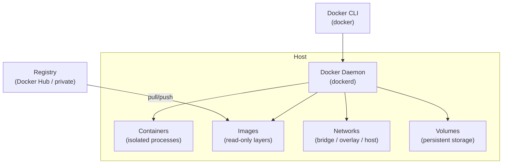

# Docker CLI — Core Cheat Sheet

> Container · Image · Network · Volume · System  
> Xem thêm: [README.md](README.md) (index) · [README-compose.md](README-compose.md) · [README-swarm.md](README-swarm.md) · [README-dockerfile.md](README-dockerfile.md)

## Kiến trúc tổng quan



---

## 1. Container

> Đơn vị chạy ứng dụng. Image = bản thiết kế, Container = instance đang chạy.

### Dùng thường xuyên

| Lệnh | Mô tả |
|------|-------|
| `docker container run -d --name <n> -p <host>:<ctr> <image>` | Tạo & chạy container ngầm, map port |
| `docker container run -it <image> bash` | Chạy interactive shell |
| `docker container run --rm <image>` | Chạy xong tự xóa (dùng cho task 1 lần) |
| `docker container ls` | Liệt kê container đang chạy |
| `docker container ls -a` | Liệt kê tất cả (kể cả đã dừng) |
| `docker container stop/start/restart <n>` | Điều khiển vòng đời |
| `docker container rm <n>` | Xóa container đã dừng |
| `docker container rm -f <n>` | Xóa ngay dù đang chạy |
| `docker container logs -f <n>` | Xem log real-time |
| `docker container exec -it <n> bash` | Mở shell vào container đang chạy |

### Ít dùng hơn

| Lệnh | Mô tả |
|------|-------|
| `docker container inspect <n>` | Xem toàn bộ metadata (JSON) |
| `docker container stats` | Monitor CPU/RAM real-time |
| `docker container top <n>` | Xem process trong container |
| `docker container cp <n>:/path ./local` | Copy file ra ngoài container |
| `docker container prune` | Xóa tất cả container đã dừng |
| `docker container rename <old> <new>` | Đổi tên container |
| `docker container pause/unpause <n>` | Tạm dừng / tiếp tục |
| `docker container port <n>` | Xem port mapping |

### Các option quan trọng của `run`

| Option | Ý nghĩa |
|--------|---------|
| `-d` | Chạy ngầm (detach) |
| `-p 8080:3000` | Map port host:container |
| `-v /host:/ctr` | Mount thư mục hoặc volume |
| `-e KEY=val` | Set biến môi trường |
| `--name myapp` | Đặt tên container |
| `--network mynet` | Gắn vào network |
| `--restart unless-stopped` | Tự khởi động lại (trừ khi dừng thủ công) |
| `--rm` | Tự xóa sau khi exit |
| `-m 512m` | Giới hạn RAM |
| `--cpus 0.5` | Giới hạn CPU |

---

## 2. Image

> Layer read-only, build từ Dockerfile. Pull về để dùng, push lên registry để chia sẻ.

### Dùng thường xuyên

| Lệnh | Mô tả |
|------|-------|
| `docker image build -t <name>:<tag> .` | Build image từ Dockerfile ở thư mục hiện tại |
| `docker image pull <name>:<tag>` | Tải image từ registry |
| `docker image push <name>:<tag>` | Đẩy image lên registry |
| `docker image ls` | Liệt kê image đang có |
| `docker image rm <id>` | Xóa image |
| `docker image tag <src> <dst>` | Tạo alias cho image (trước khi push) |

### Ít dùng hơn

| Lệnh | Mô tả |
|------|-------|
| `docker image inspect <name>` | Xem metadata chi tiết |
| `docker image history <name>` | Xem các layer và dung lượng |
| `docker image prune` | Xóa dangling images (không có tag) |
| `docker image prune -a` | Xóa mọi image không được dùng |
| `docker image save -o file.tar <name>` | Export image ra file |
| `docker image load -i file.tar` | Import image từ file |

### Các flag quan trọng của `docker image build`

| Flag | Ý nghĩa |
|------|---------|
| `-t <name>:<tag>` | Đặt tên và tag cho image |
| `-f Dockerfile.prod` | Chỉ định Dockerfile khác (mặc định: `./Dockerfile`) |
| `--no-cache` | Build lại toàn bộ, bỏ qua cache — dùng khi nghi cache stale |
| `--build-arg KEY=val` | Truyền giá trị vào `ARG` trong Dockerfile |
| `--target <stage>` | Build đến stage cụ thể trong multi-stage Dockerfile |
| `--platform linux/amd64` | Build cho platform cụ thể (xem buildx bên dưới) |

```bash
# Ví dụ kết hợp
docker image build \
  -f Dockerfile.prod \
  --no-cache \
  --build-arg APP_VERSION=1.2.3 \
  --target production \
  -t myapp:1.2.3 .
```

### Workflow tag & push lên private registry

```bash
# Quy tắc đặt tên: <registry>/<namespace>/<image>:<tag>
# Docker Hub:     username/image:tag
# Private/ECR:    registry.example.com/org/image:tag

# 1. Build
docker image build -t myapp:1.2.3 .

# 2. Tag cho registry đích
docker image tag myapp:1.2.3 registry.example.com/org/myapp:1.2.3

# 3. Login và push
docker login registry.example.com
docker image push registry.example.com/org/myapp:1.2.3
```

### `docker buildx` — build multi-platform

> Cần thiết khi build trên Mac M1/M2 (arm64) để ra image chạy trên server Linux (amd64).

| Lệnh | Mô tả |
|------|-------|
| `docker buildx ls` | Liệt kê builders hiện có |
| `docker buildx create --use` | Tạo và kích hoạt builder mới (hỗ trợ multi-platform) |
| `docker buildx build --platform linux/amd64,linux/arm64 -t  --push .` | Build cho nhiều platform, push thẳng lên registry |
| `docker buildx build --platform linux/amd64 -t  --load .` | Build cho 1 platform, load vào Docker local |

```bash
# Pattern thực tế: build & push multi-arch
docker buildx create --use
docker buildx build \
  --platform linux/amd64,linux/arm64 \
  -t registry.example.com/org/myapp:1.2.3 \
  --push .
```

> `--push` thay vì `--load` vì multi-platform image không load được vào Docker local.

---

## 3. Network

> Mạng nội bộ để container giao tiếp. DNS tự động theo tên container trong user-defined bridge.

```mermaid
graph LR
    subgraph Bridge Network "mynet"
        A["container: web\n(web:80)"] -- HTTP --> B["container: api\n(api:3000)"]
        B -- SQL --> C["container: db\n(db:5432)"]
    end
    Host["Host :8080"] -- port mapping --> A
```

### Dùng thường xuyên

| Lệnh | Mô tả |
|------|-------|
| `docker network create <name>` | Tạo bridge network (dùng cho local dev) |
| `docker network ls` | Liệt kê các network |
| `docker network connect <net> <ctr>` | Gắn container vào network |
| `docker network disconnect <net> <ctr>` | Tách container khỏi network |

### Ít dùng hơn

| Lệnh | Mô tả |
|------|-------|
| `docker network inspect <name>` | Xem IP, subnet, container trong network |
| `docker network rm <name>` | Xóa network |
| `docker network prune` | Xóa network không dùng |
| `docker network create --driver overlay <name>` | Tạo overlay network (dùng cho Swarm) |

**3 loại network phổ biến:**

| Type | Khi nào dùng |
|------|-------------|
| `bridge` (mặc định) | Containers trên cùng 1 host |
| `host` | Container dùng trực tiếp network của host (Linux only) |
| `overlay` | Containers trên nhiều host (Swarm) |

---

## 4. Volume

> Lưu trữ persistent data ngoài vòng đời container. Xóa container không xóa volume.

### Dùng thường xuyên

| Lệnh | Mô tả |
|------|-------|
| `docker volume create <name>` | Tạo named volume |
| `docker volume ls` | Liệt kê volumes |
| `docker volume rm <name>` | Xóa volume |
| `docker volume prune` | Xóa tất cả volume không dùng |

### Ít dùng hơn

| Lệnh | Mô tả |
|------|-------|
| `docker volume inspect <name>` | Xem đường dẫn thực trên host |

**2 cách mount:**

```bash
# Named volume (Docker quản lý, dữ liệu an toàn khi rm container)
docker run -v mydata:/app/data myapp

# Bind mount (sync với thư mục host — dùng khi dev)
docker run -v $(pwd)/src:/app/src myapp
```

---

## 5. System & Quản trị

### Dùng thường xuyên

| Lệnh | Mô tả |
|------|-------|
| `docker system df` | Xem dung lượng dùng bởi images/containers/volumes |
| `docker system prune` | Dọn sạch mọi thứ không dùng (hỏi trước) |
| `docker system prune -a --volumes` | Dọn sạch triệt để kể cả volumes |
| `docker info` | Thông tin cấu hình Docker daemon |
| `docker version` | Phiên bản client & server |
| `docker login <registry>` | Đăng nhập registry |
| `docker logout` | Đăng xuất |

### Ít dùng hơn

| Lệnh | Mô tả |
|------|-------|
| `docker context ls` | Xem danh sách Docker context (kết nối remote) |
| `docker context use <name>` | Chuyển sang context khác |
| `docker search <keyword>` | Tìm image trên Docker Hub |
| `docker inspect <obj>` | Xem metadata bất kỳ object |

---

## 6. Global Options

| Option | Mô tả |
|--------|-------|
| `--help` | Hiển thị hướng dẫn cho bất kỳ lệnh nào |
| `-H, --host` | Kết nối tới daemon khác (vd: `tcp://remote:2376`) |
| `--context` | Dùng context cụ thể |
| `-D, --debug` | Bật debug mode |
| `--log-level` | Mức log: debug / info / warn / error / fatal |
| `--config` | Chỉ định thư mục config (mặc định: `~/.docker`) |

---

> **Quy tắc nhớ:** Luôn dùng cú pháp `docker <object> <verb>` thay vì lệnh cũ (`docker rm`, `docker rmi`...) để đồng nhất và tránh nhầm lẫn.
