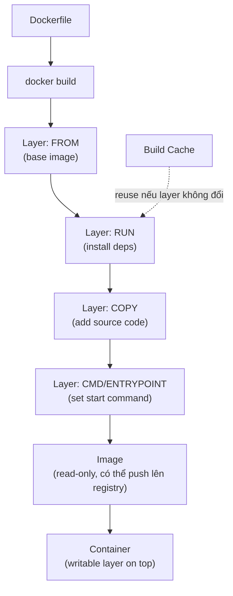
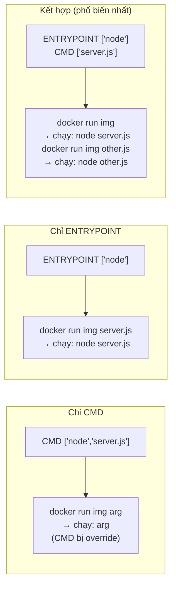
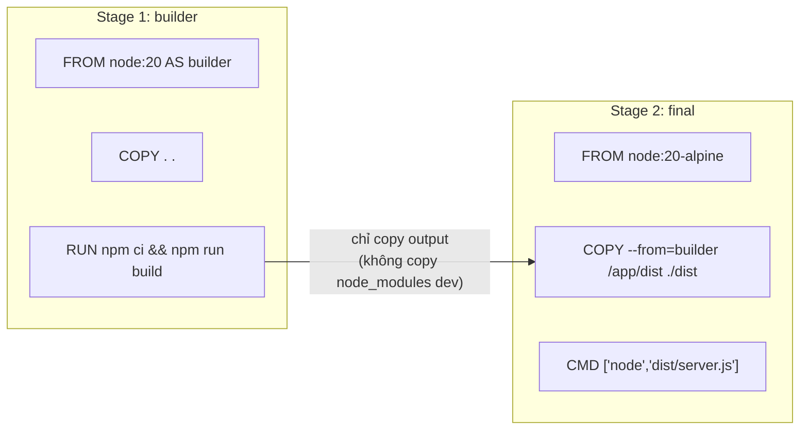

# Dockerfile — Cheat Sheet

> File định nghĩa cách build Docker image. Mỗi instruction tạo 1 layer.  
> Build bằng: `docker image build -t <name>:<tag> .`

---

## Flow build image



---

## Các instruction

### Dùng thường xuyên

| Instruction | Syntax | Mô tả |
|-------------|--------|-------|
| `FROM` | `FROM <image>:<tag> [AS <name>]` | Base image — phải là instruction đầu tiên |
| `RUN` | `RUN <command>` | Chạy lệnh khi build (tạo layer mới) |
| `COPY` | `COPY <src> <dest>` | Copy file từ build context vào image |
| `CMD` | `CMD ["executable","arg"]` | Lệnh mặc định khi container start (override được) |
| `ENTRYPOINT` | `ENTRYPOINT ["executable"]` | Lệnh cố định khi container start (khó override hơn) |
| `ENV` | `ENV KEY=value` | Set biến môi trường (tồn tại trong container) |
| `ARG` | `ARG NAME=default` | Biến tại build time (không có trong image cuối) |
| `WORKDIR` | `WORKDIR /app` | Đặt thư mục làm việc cho các lệnh tiếp theo |
| `EXPOSE` | `EXPOSE 3000` | Document port container lắng nghe (không thực sự publish) |

### Ít dùng hơn

| Instruction | Syntax | Mô tả |
|-------------|--------|-------|
| `ADD` | `ADD <src> <dest>` | Như COPY nhưng hỗ trợ URL và tự giải nén tar — **ưu tiên COPY** |
| `VOLUME` | `VOLUME ["/data"]` | Khai báo mount point (Docker auto tạo anonymous volume) |
| `USER` | `USER <user>` | Đặt user chạy các lệnh tiếp theo (nên set để tránh chạy root) |
| `LABEL` | `LABEL key=value` | Gắn metadata vào image (version, maintainer...) |
| `HEALTHCHECK` | `HEALTHCHECK CMD <cmd>` | Định nghĩa cách kiểm tra container còn healthy không |
| `STOPSIGNAL` | `STOPSIGNAL SIGTERM` | Signal gửi khi `docker stop` (mặc định SIGTERM) |
| `SHELL` | `SHELL ["/bin/sh","-c"]` | Đổi shell dùng cho shell-form RUN/CMD/ENTRYPOINT |
| `ONBUILD` | `ONBUILD <instruction>` | Trigger chạy khi image này được dùng làm base image khác |

---

## CMD vs ENTRYPOINT



**Quy tắc:** Dùng `ENTRYPOINT` cho executable chính, `CMD` cho default arguments.

---

## RUN: Shell form vs Exec form

```dockerfile
# Shell form — chạy qua /bin/sh -c, hỗ trợ pipe, biến
RUN apt-get update && apt-get install -y curl

# Exec form — không qua shell, không hỗ trợ pipe, tránh shell injection
RUN ["apt-get", "install", "-y", "curl"]
```

**Ưu tiên exec form cho CMD và ENTRYPOINT** để process nhận signal đúng (PID 1).

---

## ARG vs ENV

| | `ARG` | `ENV` |
|---|-------|-------|
| Có tác dụng khi | Build time | Build time + Runtime |
| Tồn tại trong image | Không | Có |
| Override | `--build-arg KEY=val` | `docker run -e KEY=val` |
| Dùng cho | Build config (version, platform) | App config (URL, mode) |

```dockerfile
ARG NODE_VERSION=20           # chỉ dùng lúc build
FROM node:${NODE_VERSION}

ENV NODE_ENV=production       # tồn tại trong container
```

---

## Multi-stage Build

> Tách build environment khỏi runtime image — giảm kích thước image cuối đáng kể.



```dockerfile
# Stage 1: build
FROM node:20 AS builder
WORKDIR /app
COPY package*.json ./
RUN npm ci
COPY . .
RUN npm run build

# Stage 2: production image (nhỏ gọn)
FROM node:20-alpine
WORKDIR /app
COPY --from=builder /app/dist ./dist
COPY --from=builder /app/node_modules ./node_modules
EXPOSE 3000
CMD ["node", "dist/server.js"]
```

---

## Best Practices

### 1. Sắp xếp layer đúng thứ tự để tận dụng cache

```dockerfile
# Tốt: copy dependency file trước, install, rồi mới copy source
COPY package*.json ./
RUN npm ci
COPY . .          # thay đổi source không invalidate cache install

# Tệ: copy tất cả trước → mọi thay đổi source đều rebuild deps
COPY . .
RUN npm ci
```

### 2. Gộp RUN để giảm số layer

```dockerfile
# Tốt
RUN apt-get update && \
    apt-get install -y curl git && \
    rm -rf /var/lib/apt/lists/*

# Tệ: 3 layer riêng, cache không hiệu quả
RUN apt-get update
RUN apt-get install -y curl
RUN apt-get install -y git
```

### 3. Không chạy với user root

```dockerfile
RUN addgroup --system app && adduser --system --ingroup app app
USER app
```

### 4. Dùng `.dockerignore`

```
node_modules
.git
*.log
.env
dist
```

### 5. Dùng image tag cụ thể, không dùng `latest`

```dockerfile
# Tốt — reproducible build
FROM node:20.15-alpine

# Tệ — không biết version thực sự là gì
FROM node:latest
```

### 6. HEALTHCHECK để Compose/Swarm biết container sẵn sàng

```dockerfile
HEALTHCHECK --interval=30s --timeout=5s --retries=3 \
    CMD curl -f http://localhost:3000/health || exit 1
```

---

## Ví dụ Dockerfile hoàn chỉnh (Node.js)

```dockerfile
FROM node:20-alpine AS builder
WORKDIR /app
COPY package*.json ./
RUN npm ci --only=production

FROM node:20-alpine
LABEL org.opencontainers.image.source="https://github.com/org/repo"

# Chạy với non-root user
RUN addgroup -S app && adduser -S app -G app
WORKDIR /app

COPY --from=builder /app/node_modules ./node_modules
COPY . .

ENV NODE_ENV=production
EXPOSE 3000

HEALTHCHECK --interval=30s --timeout=5s \
    CMD wget -qO- http://localhost:3000/health || exit 1

USER app
CMD ["node", "server.js"]
```

---

> **Tóm tắt:** `FROM` → `WORKDIR` → `COPY deps` → `RUN install` → `COPY source` → `EXPOSE` → `USER` → `CMD`  
> Đây là thứ tự chuẩn tối ưu cache và bảo mật.
