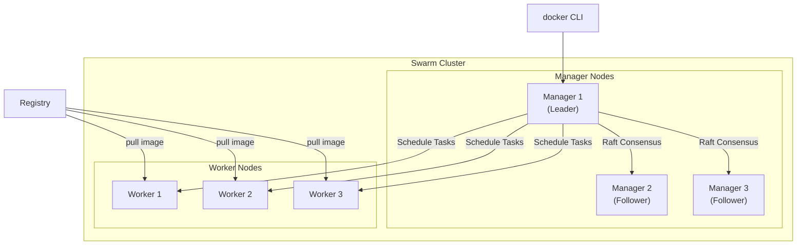
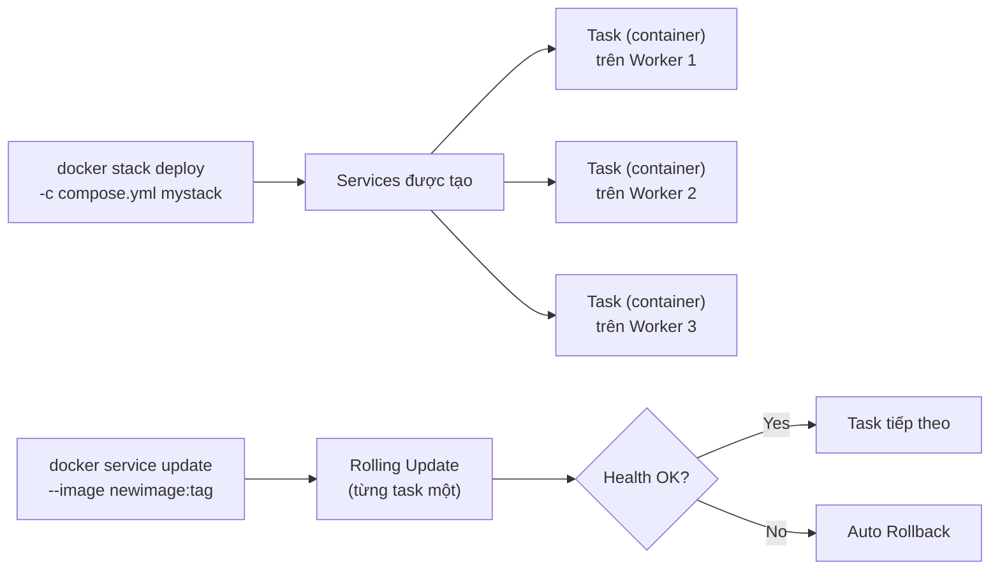
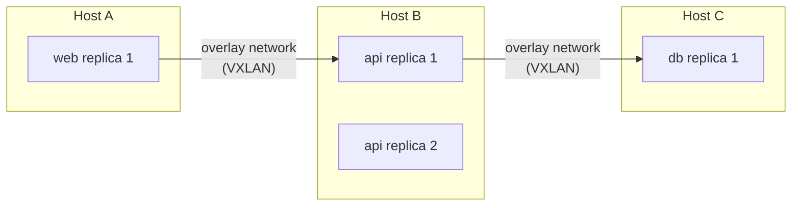

# Docker Swarm CLI — Cheat Sheet

## Kiến trúc tổng quan



> **Manager** = điều phối cluster, lưu trạng thái (Raft). **Worker** = chỉ chạy task.  
> Production nên có **3 hoặc 5 Manager** để đảm bảo HA (tối đa chịu được (N-1)/2 node manager lỗi).

---

## Flow triển khai Service / Stack



---

## 1. Khởi tạo & Quản lý Cluster

### Dùng thường xuyên

| Lệnh | Mô tả |
|------|-------|
| `docker swarm init` | Khởi tạo Swarm, node hiện tại trở thành Manager |
| `docker swarm init --advertise-addr <IP>` | Khi host có nhiều interface, chỉ rõ IP cho Swarm |
| `docker swarm join --token <token> <ip>:2377` | Tham gia cluster với vai trò Worker hoặc Manager |
| `docker swarm join-token worker` | Lấy lệnh join cho Worker |
| `docker swarm join-token manager` | Lấy lệnh join cho Manager |
| `docker swarm leave` | Worker rời cluster |
| `docker swarm leave --force` | Manager rời cluster (cảnh báo: phá vỡ cluster nếu còn 1 manager) |

### Ít dùng hơn

| Lệnh | Mô tả |
|------|-------|
| `docker swarm update --task-history-limit 3` | Giới hạn lịch sử task lưu lại |
| `docker swarm update --autolock=true` | Bật auto-lock (yêu cầu unlock key khi manager restart) |
| `docker swarm unlock` | Mở khóa Swarm sau khi manager restart (khi bật autolock) |
| `docker swarm unlock-key` | Xem / rotate unlock key |
| `docker swarm ca --rotate` | Rotate root CA certificate |

---

## 2. Quản lý Node

> Chỉ chạy được trên **Manager node**.

### Dùng thường xuyên

| Lệnh | Mô tả |
|------|-------|
| `docker node ls` | Liệt kê tất cả node, xem trạng thái và vai trò |
| `docker node inspect <id> --pretty` | Xem thông tin node dễ đọc |
| `docker node update --availability drain <id>` | Đưa node vào bảo trì (di chuyển hết task sang node khác) |
| `docker node update --availability active <id>` | Đưa node trở lại hoạt động |
| `docker node promote <id>` | Nâng Worker lên Manager |
| `docker node demote <id>` | Hạ Manager xuống Worker |

### Ít dùng hơn

| Lệnh | Mô tả |
|------|-------|
| `docker node update --label-add env=prod <id>` | Thêm label để pin service lên node cụ thể |
| `docker node rm <id>` | Xóa node đã rời khỏi cluster |
| `docker node ps <id>` | Xem task đang chạy trên node đó |

**Availability values:**

| Giá trị | Ý nghĩa |
|---------|---------|
| `active` | Node nhận task bình thường |
| `pause` | Không nhận task mới, task cũ vẫn chạy |
| `drain` | Không nhận task, task cũ được chuyển đi — dùng để bảo trì |

---

## 3. Quản lý Service

> Service = định nghĩa "muốn chạy N replica của image X". Swarm tự đảm bảo số replica luôn đúng.

### Dùng thường xuyên

| Lệnh | Mô tả |
|------|-------|
| `docker service create --name <n> --replicas 3 -p 80:80 <image>` | Tạo service với 3 replica, publish port |
| `docker service ls` | Liệt kê service và số replica thực tế / mong muốn |
| `docker service ps <name>` | Xem từng task (container) chạy trên node nào |
| `docker service logs -f <name>` | Xem log tổng hợp từ tất cả replica |
| `docker service scale <name>=5` | Tăng / giảm số replica |
| `docker service update --image <new>:<tag> <name>` | Rolling update sang image mới |
| `docker service rollback <name>` | Quay về config trước khi update |
| `docker service rm <name>` | Xóa service |

### Ít dùng hơn

| Lệnh | Mô tả |
|------|-------|
| `docker service inspect <name> --pretty` | Xem cấu hình đầy đủ dễ đọc |
| `docker service update --replicas 0 <name>` | Tạm dừng service (scale về 0) |
| `docker service update --constraint-add node.labels.env==prod <name>` | Pin service lên node có label cụ thể |
| `docker service update --update-parallelism 2 --update-delay 10s <name>` | Kiểm soát tốc độ rolling update |
| `docker service update --secret-add mysecret <name>` | Thêm secret vào service đang chạy |
| `docker service update --limit-memory 512m <name>` | Giới hạn RAM |

### Các option quan trọng của `service create`

| Option | Ý nghĩa |
|--------|---------|
| `--replicas 3` | Số lượng bản chạy song song |
| `-p 8080:80` | Publish port (routing mesh — mọi node đều nhận) |
| `--network <name>` | Gắn vào overlay network |
| `--env KEY=val` | Biến môi trường |
| `--mount type=volume,src=v,dst=/data` | Mount volume |
| `--secret <name>` | Inject secret (lưu trong Raft, an toàn hơn env) |
| `--constraint node.role==worker` | Chỉ chạy trên Worker |
| `--update-parallelism 1` | Rolling update từng task một |
| `--update-failure-action rollback` | Tự rollback nếu update thất bại |
| `--restart-condition on-failure` | Chỉ restart khi lỗi |

---

## 4. Quản lý Stack

> Stack = deploy nhiều service từ file `compose.yaml` — cách được khuyến nghị cho production.

### Dùng thường xuyên

| Lệnh | Mô tả |
|------|-------|
| `docker stack deploy -c compose.yaml <stack>` | Triển khai hoặc cập nhật stack |
| `docker stack ls` | Liệt kê các stack đang chạy |
| `docker stack services <stack>` | Xem service trong stack và replica count |
| `docker stack ps <stack>` | Xem từng task và node nó chạy |
| `docker stack rm <stack>` | Xóa toàn bộ stack và service con |

### Ít dùng hơn

| Lệnh | Mô tả |
|------|-------|
| `docker stack config -c compose.yaml` | Validate và xem config sau khi merge / interpolate |
| `docker stack deploy -c a.yml -c b.yml <stack>` | Merge nhiều compose file khi deploy |

---

## 5. Secret & Config

> Lưu trữ thông tin nhạy cảm / cấu hình trong Raft database (mã hóa), inject vào service.

### Secret (dữ liệu nhạy cảm: password, token, cert)

| Lệnh | Mô tả |
|------|-------|
| `echo "mypassword" \| docker secret create db_pass -` | Tạo secret từ stdin |
| `docker secret create db_pass ./secret.txt` | Tạo secret từ file |
| `docker secret ls` | Liệt kê secrets |
| `docker secret rm <name>` | Xóa secret |

Secret được mount vào `/run/secrets/<name>` trong container.

### Config (cấu hình không nhạy cảm: nginx.conf, ...)

| Lệnh | Mô tả |
|------|-------|
| `docker config create nginx_conf ./nginx.conf` | Tạo config |
| `docker config ls` | Liệt kê configs |
| `docker config rm <name>` | Xóa config |

---

## 6. Overlay Network (Swarm)

> Kết nối container trên nhiều host như thể cùng LAN. Bắt buộc phải dùng trong Swarm.



| Lệnh | Mô tả |
|------|-------|
| `docker network create -d overlay --attachable mynet` | Tạo overlay network có thể attach container thủ công |
| `docker network ls` | Xem tất cả network (overlay chỉ thấy trên manager) |

---

## 7. Ví dụ compose.yaml cho Swarm Stack

```yaml
services:
  web:
    image: myapp:latest
    ports:
      - "80:3000"
    networks:
      - appnet
    deploy:
      replicas: 3
      update_config:
        parallelism: 1
        delay: 10s
        failure_action: rollback
      restart_policy:
        condition: on-failure
      resources:
        limits:
          memory: 512m

  db:
    image: postgres:16
    networks:
      - appnet
    volumes:
      - pgdata:/var/lib/postgresql/data
    secrets:
      - db_password
    deploy:
      replicas: 1
      placement:
        constraints:
          - node.labels.role == db

secrets:
  db_password:
    external: true

volumes:
  pgdata:

networks:
  appnet:
    driver: overlay
```

> **Lưu ý:** Khóa `deploy:` chỉ có tác dụng khi dùng `docker stack deploy`. Bị bỏ qua khi dùng `docker compose up`.

---

## 8. Cheat: Swarm vs Compose

| Tiêu chí | Docker Compose | Docker Swarm |
|----------|---------------|-------------|
| Môi trường | Local dev | Production / multi-host |
| Số host | 1 | Nhiều |
| HA / Failover | Không | Có |
| Rolling update | Không | Có |
| Load balancing | Không tích hợp | Có (routing mesh) |
| Secret management | Hạn chế | Có (Raft encrypted) |
| Lệnh deploy | `docker compose up` | `docker stack deploy` |

---

> **Nguyên tắc vận hành:**
> - Luôn có ít nhất **3 Manager** để cluster chịu được 1 node lỗi.
> - Dùng `drain` trước khi bảo trì node, đừng `rm` thẳng.
> - Ưu tiên `docker stack deploy` thay vì `docker service create` thủ công.
> - Không lưu secret trong biến môi trường — dùng `docker secret`.
