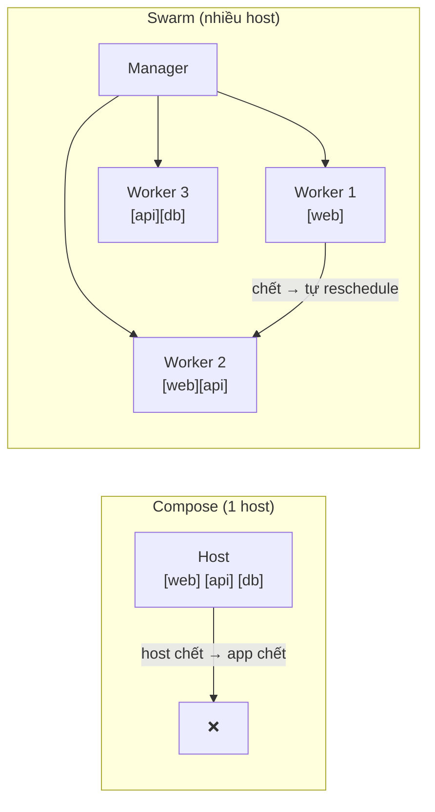
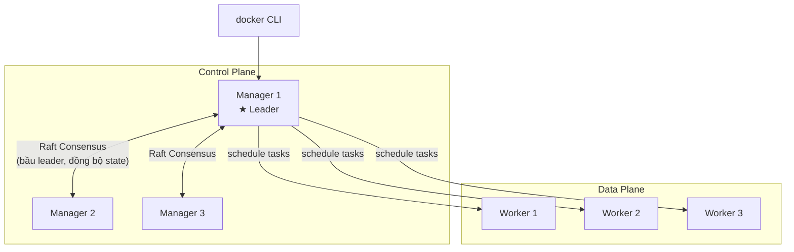
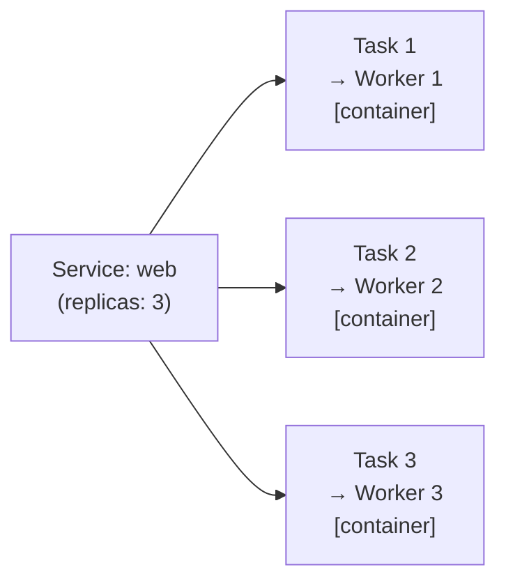
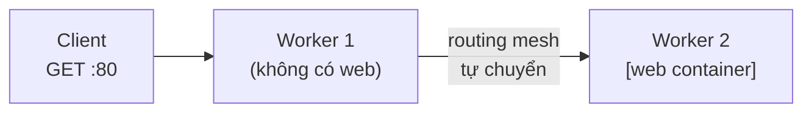

# Swarm — Concepts & Architecture

> Đọc file này trước khi làm bất cứ điều gì. Hiểu concepts giúp các bước sau không bị mơ hồ.

---

## Swarm là gì và tại sao cần?

**Docker Compose** chạy nhiều container trên **1 máy**. Nếu máy đó chết → app chết.

**Docker Swarm** chạy container trên **nhiều máy (cluster)**, tự động:
- Di chuyển container sang máy khác khi 1 máy lỗi
- Phân tải traffic giữa các bản chạy song song
- Update dần dần không downtime (rolling update)



---

## Kiến trúc chi tiết



**Manager node:**
- Lưu trạng thái cluster trong distributed store (Raft)
- Nhận lệnh từ CLI
- Quyết định task chạy trên worker nào
- Bầu Leader trong nhóm Manager (Raft algorithm)

**Worker node:**
- Chỉ chạy task (container)
- Báo cáo trạng thái về Manager
- Không nhận lệnh trực tiếp từ CLI

> **Quy tắc số lẻ:** Manager nên là 1, 3, hoặc 5.  
> Raft cần majority (quorum) để ra quyết định: 3 manager chịu được 1 lỗi, 5 manager chịu được 2 lỗi.  
> 2 hoặc 4 manager không tăng khả năng chịu lỗi so với 1 và 3.

---

## Thuật ngữ cần nhớ

### Node
Một máy (VM hoặc server vật lý) trong cluster. Có 2 vai trò: Manager hoặc Worker.

### Service
Định nghĩa "tôi muốn chạy image X với N bản". Đây là thứ bạn tạo và quản lý.

```
docker service create --replicas 3 nginx
```

### Task
Một bản chạy cụ thể của service trên một node. Service có 3 replicas → 3 tasks.  
Task = container + metadata (node nào, trạng thái ra sao).



### Stack
Nhóm nhiều service liên quan, deploy từ 1 file `compose.yaml`.  
Stack = Compose nhưng chạy trên Swarm cluster.

### Overlay Network
Network ảo trải rộng nhiều host. Container trên Worker 1 nói chuyện được với container trên Worker 3 qua DNS tên service — như thể cùng một máy.

### Routing Mesh
Traffic vào **bất kỳ node nào** trong cluster đều được route đến đúng container, kể cả node đó không chạy container của service đó.



---

## Swarm vs Kubernetes

| | Swarm | Kubernetes |
|--|-------|-----------|
| Độ phức tạp | Thấp — học trong vài ngày | Cao — học trong vài tuần/tháng |
| Tích hợp Docker | Native, dùng compose.yaml | Cần convert sang K8s YAML |
| Tính năng | Đủ dùng cho hầu hết use case | Phong phú hơn nhiều |
| Khi nào dùng | Team nhỏ, infra đơn giản | Scale lớn, cần ecosystem đầy đủ |

> Swarm là lựa chọn tốt để học orchestration trước khi tiếp cận Kubernetes.

---

## Thứ tự học

```
00-concepts.md  ← bạn đang ở đây
01-setup.md     → dựng cluster để thực hành
02-first-service.md → deploy service đầu tiên
03-networking.md    → hiểu overlay & routing mesh
04-stack.md         → deploy app thực tế với compose.yaml
05-secrets.md       → quản lý password, token an toàn
06-updates.md       → update không downtime
07-production.md    → patterns cho production
```
