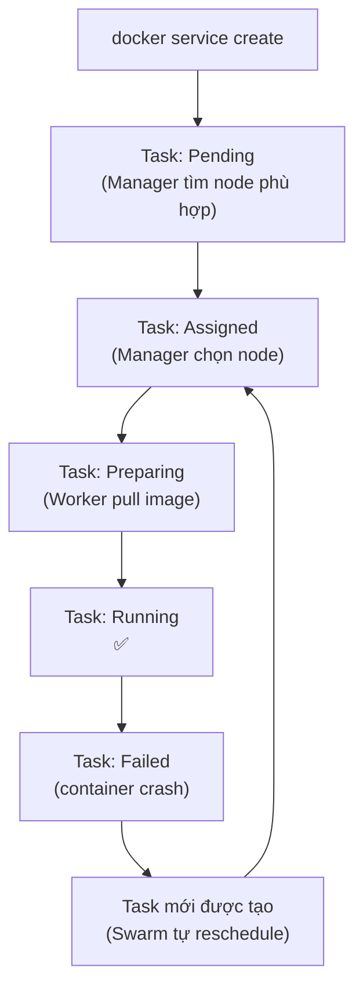

# Swarm — Deploy Service Đầu Tiên

> Mục tiêu: deploy service, scale, quan sát Swarm tự heal khi container chết.  
> Yêu cầu: đã có cluster từ [01-setup.md](01-setup.md).

---

## Vòng đời của một Service



---

## Bước 1: Deploy service đơn giản

```bash
# Deploy nginx với 1 replica, publish port 80
docker service create \
  --name web \
  --replicas 1 \
  --publish 80:80 \
  nginx:alpine

# Kiểm tra service
docker service ls
# ID         NAME   MODE       REPLICAS  IMAGE
# abc123     web    replicated 1/1       nginx:alpine
```

`1/1` nghĩa là: muốn 1 replica, đang chạy 1 replica — khớp nhau ✅

```bash
# Xem task đang chạy trên node nào
docker service ps web
# ID        NAME    IMAGE         NODE      DESIRED STATE  CURRENT STATE
# xyz       web.1   nginx:alpine  worker1   Running        Running 10s ago
```

```bash
# Test: gọi thử
curl http://localhost:80
# hoặc mở trình duyệt vào localhost:80
```

---

## Bước 2: Scale lên nhiều replica

```bash
# Scale lên 3 replica
docker service scale web=3

# Quan sát — chạy lệnh này và nhìn cột CURRENT STATE thay đổi
docker service ps web
# NAME    NODE      CURRENT STATE
# web.1   worker1   Running
# web.2   worker2   Running    ← mới
# web.3   manager   Running    ← mới
```

> Swarm tự phân bổ replica đều trên các node (spread strategy mặc định).

```bash
# Scale down
docker service scale web=1
```

---

## Bước 3: Quan sát self-healing

Đây là tính năng quan trọng nhất của Swarm — **tự khôi phục khi container chết**.

```bash
# Scale lên 3 để dễ quan sát
docker service scale web=3

# Tìm ID của 1 container đang chạy
docker service ps web
# Giả sử web.1 chạy trên worker1

# Nếu dùng DinD: xóa container thẳng trên worker1
docker exec worker1 docker ps
# Lấy container ID rồi kill
docker exec worker1 docker kill <container-id>

# Quan sát Swarm phản ứng (theo dõi real-time)
watch docker service ps web
# Sẽ thấy:
# web.1   worker1  Shutdown   Exit(137) 5s ago
# web.4   worker2  Running    Running   2s ago   ← task mới được tạo tự động!
```

> Swarm phát hiện task chết, tạo task mới trên node còn sống — **không cần can thiệp thủ công**.

---

## Bước 4: Xem log

```bash
# Log của tất cả replica (tổng hợp)
docker service logs -f web

# Log hiện thị từ replica nào đang chạy
# Prefix mỗi dòng: web.1.xyz | ...
```

---

## Bước 5: Update image

```bash
# Update sang image mới hơn
docker service update --image nginx:1.27-alpine web

# Quan sát quá trình update từng task một (rolling)
docker service ps web
# web.1  nginx:1.27-alpine  Running    ← updated
# web.2  nginx:alpine       Shutdown   ← old (đang được replace)
# web.3  nginx:alpine       Running    ← chờ đến lượt
```

---

## Bước 6: Xóa service

```bash
docker service rm web

# Kiểm tra
docker service ls
# (trống)
```

---

## Tóm tắt các lệnh trong bài

```bash
docker service create --name <n> --replicas <N> --publish <h>:<c> <image>
docker service ls                    # danh sách service
docker service ps <name>             # task đang chạy trên node nào
docker service logs -f <name>        # xem log
docker service scale <name>=<N>      # scale
docker service update --image  <name>  # update image
docker service rm <name>             # xóa
```

---

## Điểm khác biệt với `docker run`

| | `docker run` | `docker service create` |
|--|-------------|------------------------|
| Chạy trên | Host hiện tại | Node do Swarm chọn |
| Số lượng | 1 container | N replicas |
| Failover | Không | Tự động |
| Update | Phải rm + run lại | Rolling update |
| Scale | Không | `service scale` |

---

**Tiếp theo:** [03-networking.md](03-networking.md) — Overlay network và cách service tìm nhau.
