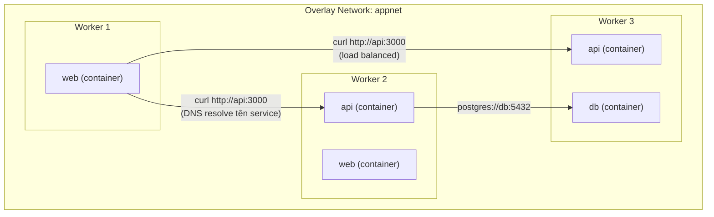
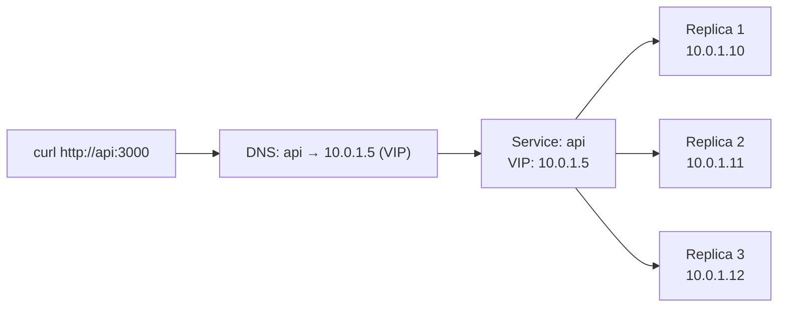
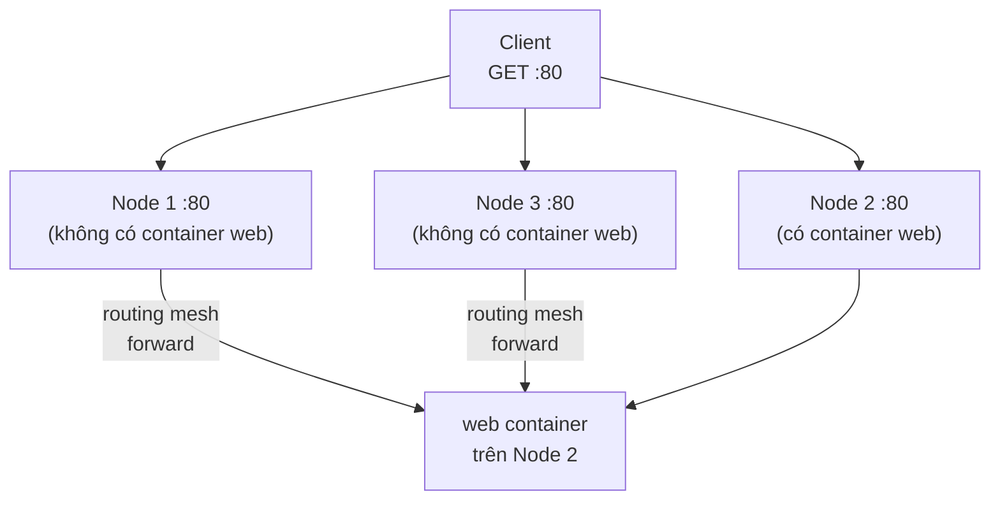

# Swarm — Networking: Overlay & Routing Mesh

> Mục tiêu: hiểu cách service tìm nhau qua tên, và traffic từ ngoài vào được route thế nào.

---

## 2 network mặc định của Swarm

Khi init Swarm, Docker tạo sẵn 2 network:

```bash
docker network ls
# NAME              DRIVER    SCOPE
# ingress           overlay   swarm    ← routing mesh (traffic từ ngoài vào)
# docker_gwbridge   bridge    local    ← kết nối container với host
```

**`ingress`** — network đặc biệt, xử lý routing mesh: traffic vào bất kỳ node nào cũng được forward đến đúng container.

**Vấn đề:** các service của bạn **không nên dùng `ingress`** để giao tiếp nội bộ. Phải tạo overlay network riêng.

---

## Overlay Network — Service tìm nhau qua DNS



Trong overlay network, mỗi **service name** là một DNS record, tự động load balance đến các replica.

### Tạo overlay network

```bash
docker network create \
  --driver overlay \
  --attachable \
  appnet

docker network ls
# NAME     DRIVER   SCOPE
# appnet   overlay  swarm   ← mới tạo
```

> `--attachable` cho phép container thường (không phải service) attach vào để test.

### Deploy service vào overlay network

```bash
# Deploy api service
docker service create \
  --name api \
  --network appnet \
  --replicas 2 \
  --publish 3000:3000 \
  node:20-alpine

# Deploy web service — kết nối đến api qua DNS tên "api"
docker service create \
  --name web \
  --network appnet \
  --replicas 2 \
  --publish 80:80 \
  nginx:alpine
```

### Kiểm tra DNS resolution

```bash
# Chạy container test trong cùng network
docker run --rm --network appnet alpine nslookup api
# Server: 127.0.0.11     ← Docker embedded DNS
# Address 1: 10.0.1.5    ← Virtual IP của service api

# Curl thử
docker run --rm --network appnet alpine wget -qO- http://api:3000/health
```

---

## Virtual IP (VIP) — Load Balancing nội bộ

Khi bạn có service `api` với 3 replicas, DNS không trả về 3 IP riêng.  
Thay vào đó, Docker dùng **Virtual IP** — 1 IP ảo, traffic được phân bổ đến các replica phía sau.



> Bạn không cần biết IP thực của từng replica. Cứ dùng tên service là đủ.

```bash
# Xem VIP của service
docker service inspect api --format '{{json .Endpoint.VirtualIPs}}'
```

---

## Routing Mesh — Traffic từ ngoài vào

Routing mesh cho phép **publish port trên tất cả node** dù container chỉ chạy trên 1 số node.



```bash
# Publish port 80 — bất kỳ node nào cũng nhận traffic
docker service create --name web --publish 80:80 --replicas 1 nginx:alpine

# Test: gọi vào IP của bất kỳ node nào trong cluster → đều nhận được response
curl http://<ip-node-1>:80
curl http://<ip-node-2>:80  # dù web không chạy ở đây, vẫn hoạt động
curl http://<ip-node-3>:80
```

### Host mode publish (bypass routing mesh)

Đôi khi cần map thẳng port vào host (không qua routing mesh) — ví dụ khi dùng external load balancer:

```bash
docker service create \
  --name web \
  --publish mode=host,target=80,published=80 \
  --replicas 1 \
  nginx:alpine
```

> Với host mode: chỉ node đang chạy container mới nhận được traffic trực tiếp.  
> Dùng khi bạn có nginx/HAProxy bên ngoài làm LB.

---

## Bài thực hành: 2 service nói chuyện với nhau

```bash
# 1. Tạo overlay network
docker network create --driver overlay --attachable mynet

# 2. Deploy "backend" service (giả lập bằng httpd)
docker service create \
  --name backend \
  --network mynet \
  --replicas 2 \
  httpd:alpine

# 3. Deploy "frontend" service
docker service create \
  --name frontend \
  --network mynet \
  --replicas 1 \
  --publish 8080:80 \
  nginx:alpine

# 4. Vào frontend container, thử curl backend qua tên service
CONTAINER=$(docker ps --filter name=frontend -q | head -1)
docker exec $CONTAINER wget -qO- http://backend:80
# Trả về HTML của Apache → hai service đã nói chuyện được!

# 5. Dọn dẹp
docker service rm frontend backend
docker network rm mynet
```

---

## Tóm tắt

| Thứ | Mục đích |
|-----|---------|
| Overlay network | Service trên nhiều host nói chuyện nhau qua tên |
| VIP | 1 IP ảo đại diện cho toàn bộ replica, tự load balance |
| Routing mesh | Publish port trên mọi node, traffic tự tìm đến container |
| Host mode | Bypass routing mesh, dùng khi có LB ngoài |

> **Quy tắc:** Luôn tạo overlay network riêng cho app. Không để service dùng chung `ingress` để communicate nội bộ.

---

**Tiếp theo:** [04-stack.md](04-stack.md) — Deploy app thực tế với compose.yaml.
