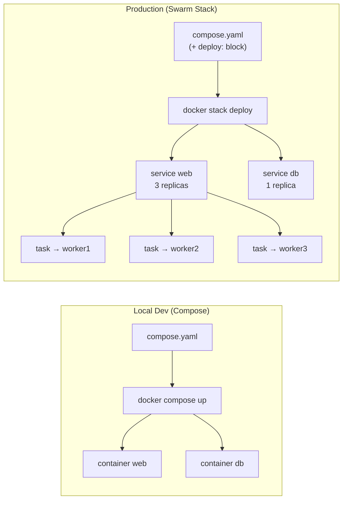

# Swarm — Stack: Deploy App Thực Tế

> Mục tiêu: viết `compose.yaml` với block `deploy:`, deploy cả stack lên Swarm.  
> Stack = Compose nhưng chạy trên cluster. Đây là cách deploy **được khuyến nghị** cho production.

---

## Sự khác biệt: Compose vs Stack



**Điểm khác biệt chính:** thêm block `deploy:` vào mỗi service trong compose.yaml.

---

## Cấu trúc block `deploy:`

```yaml
deploy:
  replicas: 3                    # số lượng bản chạy song song

  update_config:
    parallelism: 1               # update bao nhiêu task cùng lúc
    delay: 10s                   # chờ bao lâu giữa mỗi batch
    failure_action: rollback     # rollback nếu update thất bại
    order: start-first           # start mới trước rồi mới stop cũ (zero downtime)

  rollback_config:
    parallelism: 1
    delay: 5s

  restart_policy:
    condition: on-failure        # restart khi nào: on-failure | any | none
    delay: 5s                    # chờ trước khi restart
    max_attempts: 3              # thử tối đa bao nhiêu lần

  resources:
    limits:
      cpus: "0.5"                # tối đa 0.5 CPU core
      memory: 512M               # tối đa 512MB RAM
    reservations:
      cpus: "0.1"                # đảm bảo tối thiểu 0.1 CPU
      memory: 128M

  placement:
    constraints:
      - node.role == worker      # chỉ deploy lên Worker (không lên Manager)
      - node.labels.env == prod  # chỉ deploy lên node có label env=prod
```

---

## Ví dụ 1: Stack đơn giản (web + db)

```yaml
# compose.yaml
services:
  web:
    image: nginx:alpine
    ports:
      - "80:80"
    networks:
      - appnet
    deploy:
      replicas: 3
      update_config:
        parallelism: 1
        delay: 10s
        failure_action: rollback
        order: start-first
      restart_policy:
        condition: on-failure
      resources:
        limits:
          memory: 256M

  db:
    image: postgres:16-alpine
    environment:
      POSTGRES_PASSWORD_FILE: /run/secrets/db_password
    volumes:
      - pgdata:/var/lib/postgresql/data
    networks:
      - appnet
    secrets:
      - db_password
    deploy:
      replicas: 1
      placement:
        constraints:
          - node.role == manager   # db pin trên manager (có persistent storage)
      restart_policy:
        condition: any

secrets:
  db_password:
    external: true               # đã tạo bằng docker secret create

volumes:
  pgdata:

networks:
  appnet:
    driver: overlay
```

### Deploy stack này

```bash
# Tạo secret trước
echo "mysecretpassword" | docker secret create db_password -

# Deploy
docker stack deploy -c compose.yaml myapp

# Theo dõi
docker stack services myapp
# ID        NAME        MODE       REPLICAS  IMAGE
# abc       myapp_web   replicated 3/3       nginx:alpine
# def       myapp_db    replicated 1/1       postgres:16-alpine

docker stack ps myapp
# NAME          NODE      CURRENT STATE
# myapp_web.1   worker1   Running
# myapp_web.2   worker2   Running
# myapp_web.3   worker3   Running
# myapp_db.1    manager   Running
```

> **Lưu ý:** Swarm tự thêm prefix `<stack_name>_` vào tên service.  
> `web` → `myapp_web`, `db` → `myapp_db`.  
> Trong overlay network, service tìm nhau bằng tên có prefix: `http://myapp_api:3000`.

---

## Ví dụ 2: Stack thực tế (Node.js + Redis + Postgres)

```yaml
# compose.yaml — production-ready stack

services:
  api:
    image: registry.example.com/myorg/api:${IMAGE_TAG:-latest}
    ports:
      - "3000:3000"
    environment:
      NODE_ENV: production
      REDIS_URL: redis://cache:6379
      DATABASE_URL: postgres://app:$(cat /run/secrets/db_password)@db:5432/appdb
    secrets:
      - db_password
      - jwt_secret
    networks:
      - appnet
    deploy:
      replicas: 3
      update_config:
        parallelism: 1
        delay: 15s
        failure_action: rollback
        order: start-first
      restart_policy:
        condition: on-failure
        max_attempts: 3
      resources:
        limits:
          cpus: "1"
          memory: 512M
        reservations:
          memory: 128M
      placement:
        constraints:
          - node.role == worker

  cache:
    image: redis:7-alpine
    command: redis-server --appendonly yes
    volumes:
      - redisdata:/data
    networks:
      - appnet
    deploy:
      replicas: 1
      restart_policy:
        condition: any
      resources:
        limits:
          memory: 256M

  db:
    image: postgres:16-alpine
    environment:
      POSTGRES_USER: app
      POSTGRES_DB: appdb
      POSTGRES_PASSWORD_FILE: /run/secrets/db_password
    volumes:
      - pgdata:/var/lib/postgresql/data
    secrets:
      - db_password
    networks:
      - appnet
    healthcheck:
      test: ["CMD-SHELL", "pg_isready -U app -d appdb"]
      interval: 10s
      timeout: 5s
      retries: 5
    deploy:
      replicas: 1
      placement:
        constraints:
          - node.labels.storage == ssd   # pin vào node có SSD

secrets:
  db_password:
    external: true
  jwt_secret:
    external: true

volumes:
  pgdata:
  redisdata:

networks:
  appnet:
    driver: overlay
    driver_opts:
      encrypted: "true"   # mã hóa traffic giữa các node
```

---

## Deploy, Update, Rollback

### Deploy lần đầu

```bash
# Tạo secrets
echo "postgrespassword" | docker secret create db_password -
echo "myjwtsecret"      | docker secret create jwt_secret -

# Deploy với IMAGE_TAG cụ thể
IMAGE_TAG=1.2.0 docker stack deploy -c compose.yaml myapp
```

### Update stack (ví dụ: đổi image version)

```bash
# Cách 1: đổi IMAGE_TAG rồi deploy lại (Swarm tự detect thay đổi)
IMAGE_TAG=1.3.0 docker stack deploy -c compose.yaml myapp

# Cách 2: update service trực tiếp
docker service update --image registry.example.com/myorg/api:1.3.0 myapp_api
```

### Quan sát quá trình update

```bash
# Xem trạng thái rolling update
watch docker service ps myapp_api

# NAME          IMAGE     NODE     CURRENT STATE
# myapp_api.1   api:1.3   worker1  Running   10s   ← updated
# myapp_api.2   api:1.2   worker2  Running   5m    ← đang chờ
# myapp_api.3   api:1.2   worker3  Running   5m    ← đang chờ
#  \_ api.2     api:1.3   worker2  Starting  2s    ← start mới (order: start-first)
```

### Rollback khi update thất bại

```bash
# Rollback về config trước
docker service rollback myapp_api

# Kiểm tra
docker service ps myapp_api
```

### Xóa stack

```bash
docker stack rm myapp
# Xóa tất cả service và network (volumes giữ lại)

# Xóa volumes nếu muốn clean hoàn toàn
docker volume rm myapp_pgdata myapp_redisdata
```

---

## So sánh `order: start-first` vs `stop-first`

| | `stop-first` (mặc định) | `start-first` |
|--|------------------------|---------------|
| Quy trình | Dừng task cũ → start task mới | Start task mới → dừng task cũ |
| Downtime | Có thể có | Không (zero downtime) |
| Tài nguyên | Ít hơn | Cần thêm tài nguyên tạm thời |
| Dùng khi | Resource hạn chế | Production, cần uptime cao |

---

## Troubleshooting thường gặp

```bash
# Service không đủ replica — tại sao?
docker service ps myapp_api --no-trunc
# Cột ERROR sẽ cho biết lý do: no suitable node, port already in use...

# Xem log chi tiết 1 task
docker service logs myapp_api

# Service stuck ở Pending — thường do:
# 1. Không có node thỏa constraint (placement)
# 2. Không đủ resource (memory/cpu)
# 3. Image không pull được (sai registry, không có credential)
docker service inspect myapp_api --pretty
```

---

**Tiếp theo:** [05-secrets.md](05-secrets.md) — Quản lý password và config an toàn.
