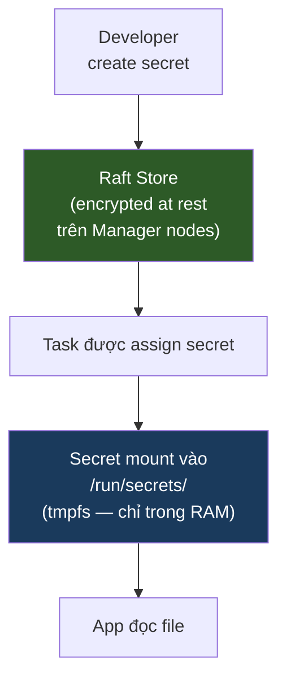

# Swarm — Secrets & Configs

> Mục tiêu: lưu trữ password, token, certificate an toàn — không hardcode vào image hay env var.

---

## Tại sao không dùng environment variable?

```bash
# ❌ Cách này rủi ro:
docker service create \
  --env DB_PASSWORD=mysecretpassword \
  myapp

# Vấn đề:
# 1. docker inspect <container> → thấy rõ password
# 2. docker service inspect → thấy rõ password
# 3. Lộ ra trong process list (ps aux)
# 4. Ai có quyền đọc service config đều thấy
```

```bash
# ✅ Cách đúng: dùng Docker Secret
docker secret create db_password ./password.txt
docker service create --secret db_password myapp
# Container đọc password từ /run/secrets/db_password (file, không phải env)
```

---

## Docker Secret hoạt động như thế nào



**Đặc điểm bảo mật:**
- Mã hóa khi lưu trữ trong Raft
- Mã hóa khi truyền qua network (TLS)
- Chỉ mount vào container được chỉ định dùng secret đó
- Mount dưới dạng `tmpfs` (RAM) — không ghi ra disk
- Không thể đọc lại giá trị sau khi tạo (chỉ xóa + tạo mới)

---

## Quản lý Secret

### Tạo secret

```bash
# Từ stdin (an toàn nhất — không lưu vào bash history)
echo "mypassword123" | docker secret create db_password -

# Từ file
docker secret create ssl_cert ./certs/server.crt

# Từ biến môi trường (tránh — giá trị còn trong history)
# Dùng cách này chỉ trong CI/CD với masked variable
printf '%s' "$DB_PASSWORD" | docker secret create db_password -
```

```bash
# Liệt kê secret (không thấy giá trị, chỉ thấy tên)
docker secret ls
# ID            NAME         CREATED
# abc123        db_password  2 minutes ago
# def456        ssl_cert     1 hour ago

# Xem metadata (không thấy giá trị)
docker secret inspect db_password
```

```bash
# Xóa secret (chỉ xóa được khi không có service nào đang dùng)
docker secret rm db_password
```

> ⚠️ Không thể đọc lại giá trị của secret sau khi tạo. Nếu quên — xóa và tạo lại.

### Dùng secret trong service

```bash
# Attach secret khi tạo service
docker service create \
  --name api \
  --secret db_password \
  --secret jwt_secret \
  myapp:latest

# Secret được mount tại:
# /run/secrets/db_password
# /run/secrets/jwt_secret
```

```bash
# Đổi tên file mount và set permission
docker service create \
  --name api \
  --secret source=db_password,target=database_password,mode=0400 \
  myapp:latest
# Mount tại /run/secrets/database_password, chỉ owner đọc được
```

```bash
# Thêm/xóa secret khi service đang chạy (trigger rolling update)
docker service update --secret-add new_secret api
docker service update --secret-rm old_secret api
```

### Đọc secret trong application

```bash
# Trong shell script
DB_PASS=$(cat /run/secrets/db_password)

# Trong Node.js
const dbPassword = require('fs').readFileSync('/run/secrets/db_password', 'utf8').trim();

# Trong Python
with open('/run/secrets/db_password') as f:
    db_password = f.read().strip()
```

---

## Docker Config

Config dùng cho **dữ liệu không nhạy cảm** (nginx.conf, app config...) nhưng cần inject vào container — tương tự secret nhưng không mã hóa.

```bash
# Tạo config từ file
docker config create nginx_conf ./nginx.conf

# Xem nội dung (khác với secret — đọc được)
docker config inspect nginx_conf --pretty

# Dùng trong service
docker service create \
  --name proxy \
  --config source=nginx_conf,target=/etc/nginx/nginx.conf \
  nginx:alpine

# Liệt kê
docker config ls

# Xóa
docker config rm nginx_conf
```

---

## Secret trong compose.yaml (Stack)

```yaml
services:
  api:
    image: myapp:latest
    secrets:
      - db_password          # mount tại /run/secrets/db_password
      - source: jwt_secret   # cú pháp dài hơn, có thể đặt target
        target: /app/jwt.key
        mode: 0400
    environment:
      # Chỉ trỏ đến file — không đặt giá trị thẳng ở đây
      DB_PASSWORD_FILE: /run/secrets/db_password

  db:
    image: postgres:16
    environment:
      # Postgres tự đọc file nếu dùng _FILE suffix
      POSTGRES_PASSWORD_FILE: /run/secrets/db_password
    secrets:
      - db_password

secrets:
  db_password:
    external: true     # đã tạo ngoài compose bằng docker secret create

  jwt_secret:
    external: true

  # Hoặc tạo inline từ file (ít dùng trong production)
  app_config:
    file: ./config/app.json
```

---

## Ví dụ thực tế: Postgres + pgAdmin với Secret

```bash
# Bước 1: Tạo secrets
echo "StrongPassword123!" | docker secret create pg_password -
echo "admin@example.com"  | docker secret create pg_email -
```

```yaml
# compose.yaml
services:
  postgres:
    image: postgres:16-alpine
    environment:
      POSTGRES_USER: admin
      POSTGRES_DB: mydb
      POSTGRES_PASSWORD_FILE: /run/secrets/pg_password
    secrets:
      - pg_password
    volumes:
      - pgdata:/var/lib/postgresql/data
    networks:
      - dbnet
    deploy:
      replicas: 1
      placement:
        constraints:
          - node.role == manager

  pgadmin:
    image: dpage/pgadmin4
    environment:
      PGADMIN_DEFAULT_EMAIL_FILE: /run/secrets/pg_email
      PGADMIN_DEFAULT_PASSWORD_FILE: /run/secrets/pg_password
    secrets:
      - pg_email
      - pg_password
    ports:
      - "5050:80"
    networks:
      - dbnet
    deploy:
      replicas: 1

secrets:
  pg_password:
    external: true
  pg_email:
    external: true

volumes:
  pgdata:

networks:
  dbnet:
    driver: overlay
```

```bash
# Deploy
docker stack deploy -c compose.yaml pgstack

# Kiểm tra
docker stack services pgstack
docker stack ps pgstack
```

---

## Rotate Secret (đổi giá trị)

Secret trong Swarm **immutable** — không sửa được, chỉ có thể thay thế.

```bash
# Bước 1: Tạo secret mới với version mới
echo "NewPassword456!" | docker secret create db_password_v2 -

# Bước 2: Update service dùng secret mới
docker service update \
  --secret-rm db_password \
  --secret-add source=db_password_v2,target=db_password \
  myapp_api
# Trigger rolling update, container mới dùng secret mới

# Bước 3: Xóa secret cũ sau khi đã update xong
docker secret rm db_password
```

---

## Tóm tắt: Secret vs Config vs Env var

| | Secret | Config | Env var |
|--|--------|--------|---------|
| Mã hóa | Có | Không | Không |
| Đọc được sau khi tạo | Không | Có | Có |
| Mount tại | `/run/secrets/` | Path tùy chọn | Bộ nhớ process |
| Dùng cho | Password, token, cert | Config file | Non-sensitive config |
| Immutable | Có | Có | Không |

---

**Tiếp theo:** [06-updates.md](06-updates.md) — Rolling update không downtime và rollback.
