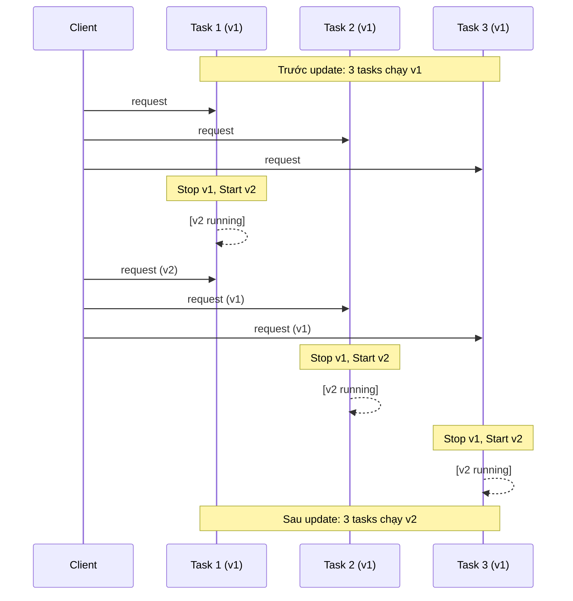
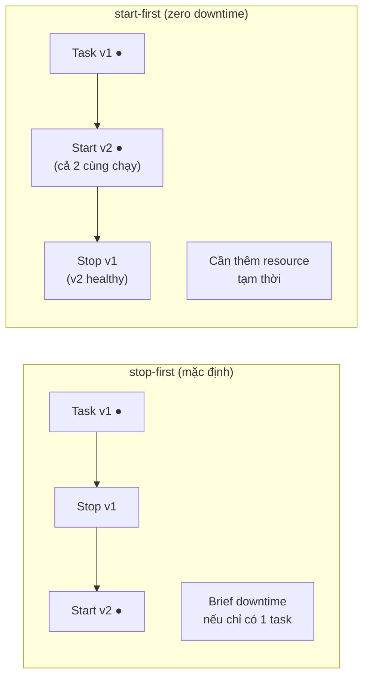
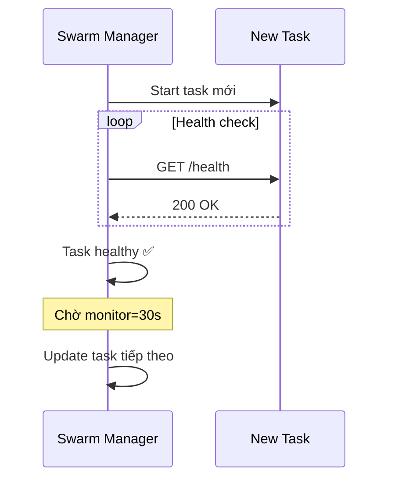

# Swarm — Rolling Update & Rollback

> Mục tiêu: update app không downtime, rollback khi có vấn đề.

---

## Rolling Update là gì

Thay vì dừng tất cả rồi update (downtime), Swarm update **từng task một** (hoặc từng batch) trong khi các task còn lại vẫn phục vụ traffic.



---

## Cấu hình update trong compose.yaml

```yaml
deploy:
  replicas: 3
  update_config:
    parallelism: 1        # update bao nhiêu task cùng lúc
    delay: 10s            # chờ bao lâu giữa mỗi batch
    order: start-first    # start task mới TRƯỚC khi stop task cũ (zero-downtime)
    failure_action: rollback   # nếu task mới fail → tự rollback
    monitor: 30s          # theo dõi task mới bao lâu trước khi coi là thành công
    max_failure_ratio: 0.1     # cho phép tối đa 10% task fail trước khi rollback

  rollback_config:
    parallelism: 1
    delay: 5s
    order: start-first
    failure_action: pause
```

### `order: start-first` vs `stop-first`



---

## Thực hành: Update với các scenario

### Setup ban đầu

```bash
# Tạo service test với 3 replicas
docker service create \
  --name web \
  --replicas 3 \
  --publish 80:80 \
  --update-parallelism 1 \
  --update-delay 10s \
  --update-order start-first \
  --update-failure-action rollback \
  nginx:1.25-alpine
```

### Scenario 1: Update thành công

```bash
# Update sang version mới
docker service update \
  --image nginx:1.27-alpine \
  web

# Theo dõi real-time (mở terminal khác)
watch -n 1 docker service ps web

# Output sẽ thấy lần lượt:
# web.1   nginx:1.27   worker1  Running    ← updated
# web.2   nginx:1.25   worker2  Running    ← đang chờ
# web.3   nginx:1.25   worker3  Running    ← đang chờ
# ...sau 10s delay...
# web.2   nginx:1.27   worker2  Running    ← updated
# ...
```

### Scenario 2: Update thất bại → auto rollback

```bash
# Update sang image không tồn tại (giả lập lỗi)
docker service update \
  --image nginx:nonexistent-tag \
  --update-failure-action rollback \
  web

# Swarm sẽ:
# 1. Thử pull image → fail
# 2. Task ở trạng thái Failed
# 3. Detect failure_action = rollback
# 4. Tự động rollback về image cũ

# Xem lịch sử
docker service ps web
# web.1   nginx:nonexistent  worker1  Failed   "No such image"
#  \_ web.1  nginx:1.27     worker1  Running  ← rollback về đây
```

### Scenario 3: Rollback thủ công

```bash
# Update sang image mới
docker service update --image nginx:1.27-alpine web

# Nhận ra có vấn đề, rollback ngay
docker service rollback web

# Kiểm tra
docker service inspect web --pretty | grep Image
# → nginx:1.25-alpine  (đã về version cũ)
```

---

## Update nhiều thứ cùng lúc

```bash
# Update cả image, env, resource cùng 1 lệnh
docker service update \
  --image myapp:2.0.0 \
  --env-add NEW_FEATURE=enabled \
  --env-rm OLD_FEATURE \
  --limit-memory 1g \
  --replicas 5 \
  myapp_api
```

---

## Dùng `docker stack deploy` để update

Cách được khuyến nghị — chỉ cần đổi file compose.yaml rồi deploy lại:

```yaml
# compose.yaml — đổi image tag
services:
  api:
    image: myapp:2.0.0    # đổi từ 1.0.0 → 2.0.0
    deploy:
      replicas: 3
      update_config:
        parallelism: 1
        delay: 15s
        order: start-first
        failure_action: rollback
```

```bash
# Chạy lại lệnh deploy — Swarm tự detect thay đổi và rolling update
docker stack deploy -c compose.yaml myapp

# Swarm so sánh desired state (compose.yaml mới) vs current state
# chỉ update những gì thay đổi
```

---

## Health Check kết hợp Update

Khi service có `healthcheck`, Swarm đợi task mới **healthy** trước khi tiếp tục update task tiếp theo.

```yaml
services:
  api:
    image: myapp:latest
    healthcheck:
      test: ["CMD", "wget", "-qO-", "http://localhost:3000/health"]
      interval: 10s
      timeout: 5s
      retries: 3
      start_period: 30s    # chờ 30s trước khi bắt đầu check (app cần thời gian start)
    deploy:
      update_config:
        monitor: 30s       # theo dõi 30s sau khi task healthy
        failure_action: rollback
```



---

## Force update (restart service không đổi image)

Đôi khi cần restart tất cả container mà không đổi image — ví dụ để load lại config:

```bash
docker service update --force web
# Trigger rolling restart toàn bộ task (dùng lại image cũ)
```

---

## Xem lịch sử update

```bash
# Xem task history (bao gồm task đã shutdown)
docker service ps web

# Xem chỉ task hiện tại
docker service ps web --filter desired-state=running

# Lọc task failed
docker service ps web --filter desired-state=shutdown
```

---

## Tóm tắt update strategy

| Tình huống | Config |
|-----------|--------|
| Zero downtime cần thiết | `order: start-first` |
| Resource hạn chế | `order: stop-first` |
| Update thận trọng từng cái | `parallelism: 1`, `delay: 30s` |
| Update nhanh | `parallelism: 2+`, `delay: 5s` |
| Auto rollback khi lỗi | `failure_action: rollback` |
| Cho phép test rồi mới tiếp | `failure_action: pause` |

---

**Tiếp theo:** [07-production.md](07-production.md) — Patterns và checklist cho production.
