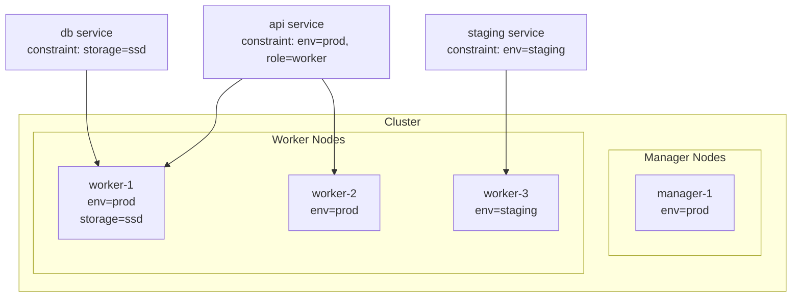

# Swarm — Production Patterns & Checklist

> Tổng hợp những gì cần làm để Swarm cluster chạy ổn định trong production.

---

## 1. Node Labels & Placement Constraints

Node label giúp pin service vào đúng loại máy — ví dụ: DB chạy trên node có SSD, worker chạy trên node có nhiều CPU.

### Thêm label vào node

```bash
# Xem node ID
docker node ls

# Thêm label
docker node update --label-add env=prod node1
docker node update --label-add storage=ssd node1
docker node update --label-add region=sg node2
docker node update --label-add gpu=true node3

# Xem label
docker node inspect node1 --pretty | grep Labels -A 5
```

### Dùng constraint trong service/stack

```yaml
deploy:
  placement:
    constraints:
      - node.role == worker          # chỉ worker (không chạy trên manager)
      - node.labels.env == prod      # node có label env=prod
      - node.labels.storage == ssd   # node có SSD
      - node.hostname == node1       # pin cứng vào 1 node (ít dùng)
    preferences:
      - spread: node.labels.region   # ưu tiên phân bổ đều theo region (soft constraint)
```

> **Constraint** = bắt buộc. **Preference** = ưu tiên nhưng không bắt buộc.



---

## 2. Resource Limits & Reservations

```yaml
deploy:
  resources:
    limits:
      cpus: "2"        # tối đa 2 CPU cores
      memory: 1G       # tối đa 1GB RAM — container bị kill nếu vượt
    reservations:
      cpus: "0.5"      # đảm bảo tối thiểu 0.5 CPU (Swarm không schedule nếu node không đủ)
      memory: 256M     # đảm bảo tối thiểu 256MB RAM
```

**Tại sao cần cả 2?**
- `limits`: bảo vệ node khỏi 1 container ăn hết resource
- `reservations`: đảm bảo Swarm không nhét quá nhiều container vào 1 node

```bash
# Xem resource đang dùng thực tế
docker stats
docker service ps web --format "table {{.Node}}\t{{.CurrentState}}"
```

---

## 3. Health Check

Health check báo cho Swarm biết container đã thực sự sẵn sàng phục vụ chưa.

```yaml
services:
  api:
    image: myapp:latest
    healthcheck:
      test: ["CMD", "wget", "-qO-", "http://localhost:3000/health"]
      interval: 15s        # check mỗi 15 giây
      timeout: 5s          # timeout nếu không trả lời trong 5s
      retries: 3           # fail 3 lần liên tiếp → unhealthy
      start_period: 60s    # cho phép app 60s để khởi động trước khi bắt đầu check
```

```bash
# Xem trạng thái health
docker service ps web
# CURRENT STATE: Running (healthy) ← tốt
# CURRENT STATE: Running (unhealthy) ← cần điều tra

# Xem log health check
docker inspect <container-id> | grep -A 20 '"Health"'
```

> **Quan trọng:** kết hợp health check với `update_config.monitor` để Swarm đợi service thực sự healthy trước khi tiếp tục rolling update.

---

## 4. Logging

Swarm gom log từ tất cả replica của 1 service:

```bash
docker service logs -f myapp_api
# myapp_api.1.xyz@worker1 | INFO: server started
# myapp_api.2.abc@worker2 | INFO: server started
# myapp_api.3.def@worker3 | ERROR: DB connection failed
```

### Cấu hình logging driver trong compose.yaml

```yaml
services:
  api:
    image: myapp:latest
    logging:
      driver: json-file       # mặc định, log lưu trên disk của mỗi node
      options:
        max-size: "50m"       # mỗi file log tối đa 50MB
        max-file: "5"         # giữ tối đa 5 file (rotate)

    # Hoặc gửi log ra centralized logging
    logging:
      driver: fluentd
      options:
        fluentd-address: fluentd:24224
        tag: myapp.api
```

---

## 5. Stack hoàn chỉnh cho Production

```yaml
# compose.prod.yaml

services:
  # Load balancer / reverse proxy
  proxy:
    image: traefik:v3
    command:
      - --providers.docker.swarmMode=true
      - --providers.docker.exposedByDefault=false
      - --entrypoints.web.address=:80
      - --entrypoints.websecure.address=:443
    ports:
      - "80:80"
      - "443:443"
    volumes:
      - /var/run/docker.sock:/var/run/docker.sock:ro
    networks:
      - proxy
    deploy:
      replicas: 1
      placement:
        constraints:
          - node.role == manager

  api:
    image: ${REGISTRY}/myorg/api:${IMAGE_TAG}
    secrets:
      - db_password
      - jwt_secret
    environment:
      NODE_ENV: production
      DB_HOST: db
      DB_PORT: "5432"
    networks:
      - proxy
      - internal
    healthcheck:
      test: ["CMD", "wget", "-qO-", "http://localhost:3000/health"]
      interval: 15s
      timeout: 5s
      retries: 3
      start_period: 30s
    logging:
      driver: json-file
      options:
        max-size: "50m"
        max-file: "5"
    deploy:
      replicas: 3
      update_config:
        parallelism: 1
        delay: 15s
        order: start-first
        failure_action: rollback
        monitor: 30s
      rollback_config:
        parallelism: 1
        delay: 5s
      restart_policy:
        condition: on-failure
        delay: 5s
        max_attempts: 3
      resources:
        limits:
          cpus: "1"
          memory: 512M
        reservations:
          cpus: "0.25"
          memory: 128M
      placement:
        constraints:
          - node.role == worker
          - node.labels.env == prod
      labels:
        - "traefik.enable=true"
        - "traefik.http.routers.api.rule=Host(`api.example.com`)"
        - "traefik.http.services.api.loadbalancer.server.port=3000"

  db:
    image: postgres:16-alpine
    environment:
      POSTGRES_USER: app
      POSTGRES_DB: appdb
      POSTGRES_PASSWORD_FILE: /run/secrets/db_password
    secrets:
      - db_password
    volumes:
      - pgdata:/var/lib/postgresql/data
    networks:
      - internal
    healthcheck:
      test: ["CMD-SHELL", "pg_isready -U app -d appdb"]
      interval: 10s
      timeout: 5s
      retries: 5
      start_period: 30s
    logging:
      driver: json-file
      options:
        max-size: "20m"
        max-file: "3"
    deploy:
      replicas: 1
      restart_policy:
        condition: any
        delay: 10s
      resources:
        limits:
          memory: 1G
        reservations:
          memory: 256M
      placement:
        constraints:
          - node.labels.storage == ssd   # DB cần SSD

secrets:
  db_password:
    external: true
  jwt_secret:
    external: true

volumes:
  pgdata:

networks:
  proxy:                  # network public (proxy ↔ services)
    driver: overlay
  internal:               # network private (services ↔ db)
    driver: overlay
    driver_opts:
      encrypted: "true"   # mã hóa traffic nội bộ
```

### Deploy production stack

```bash
# Setup labels trên nodes
docker node update --label-add env=prod --label-add storage=ssd worker-1
docker node update --label-add env=prod worker-2
docker node update --label-add env=prod worker-3

# Tạo secrets
printf 'StrongPgPassword!' | docker secret create db_password -
printf 'jwt-super-secret-key' | docker secret create jwt_secret -

# Deploy
REGISTRY=registry.example.com IMAGE_TAG=1.5.0 \
  docker stack deploy -c compose.prod.yaml myapp

# Kiểm tra
docker stack services myapp
docker stack ps myapp
```

---

## 6. Maintenance: Bảo trì Node

```bash
# Đưa node vào bảo trì (Swarm chuyển task sang node khác)
docker node update --availability drain worker-1

# Kiểm tra task đã được move chưa
docker service ps myapp_api
# Không còn task nào trên worker-1

# Thực hiện bảo trì (update OS, reboot...)
ssh worker-1 "sudo apt upgrade && sudo reboot"

# Đưa node trở lại
docker node update --availability active worker-1
```

---

## 7. Checklist Production

### Cluster
- [ ] Có ít nhất **3 Manager** (chịu được 1 manager lỗi)
- [ ] Manager **không chạy** app service (chỉ control plane)
- [ ] Mạng giữa các node thông suốt ở port 2377 (Swarm), 7946 (gossip), 4789 (VXLAN)

### Service
- [ ] Tất cả service có `healthcheck`
- [ ] Tất cả service có `resource limits` (tránh 1 container ăn hết RAM)
- [ ] Service stateful (DB) chỉ có 1 replica và pin vào node cụ thể
- [ ] `update_config.failure_action: rollback` cho tất cả service quan trọng
- [ ] `order: start-first` cho service cần zero downtime

### Secret & Security
- [ ] Không có password trong `environment:` hay image
- [ ] Tất cả secret dùng `docker secret`
- [ ] Internal network bật `encrypted: true`
- [ ] Service app **không** expose port trực tiếp ra ngoài — chỉ qua proxy

### Logging & Observability
- [ ] `logging.options.max-size` được set để tránh disk đầy
- [ ] Có centralized logging nếu cluster > 3 node

### Backup
- [ ] Volume của DB có backup định kỳ
- [ ] Biết cách export/import Raft state nếu cần recover cluster

---

## 8. Debug khi có vấn đề

```bash
# Service không đủ replica
docker service ps myapp_api --no-trunc
# Đọc cột ERROR

# Node không nhận task
docker node inspect worker-1 --pretty
# Xem Availability, Status

# Task bị Pending mãi
docker service inspect myapp_api --pretty
# Kiểm tra placement constraints có quá chặt không?

# Container restart liên tục
docker service logs myapp_api --tail 50

# Xem tất cả events của cluster
docker system events --filter type=service
```

---

> **Nguyên tắc vận hành:**  
> Treat mọi node như **cattle, not pets** — nếu node lỗi, drain và replace, không SSH vào sửa thủ công.  
> Mọi thay đổi config đi qua `docker stack deploy`, không sửa trực tiếp trên container.
