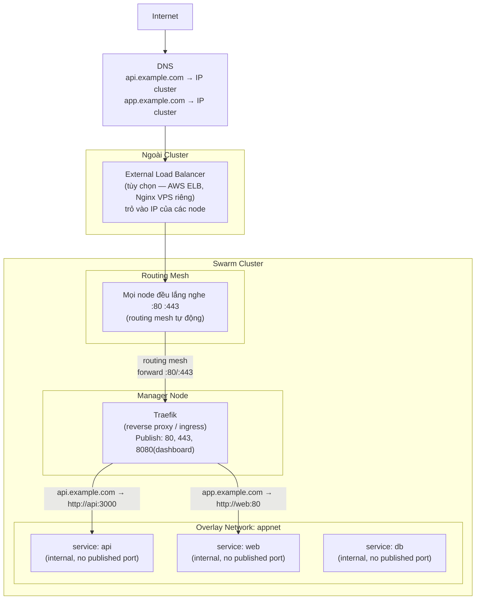
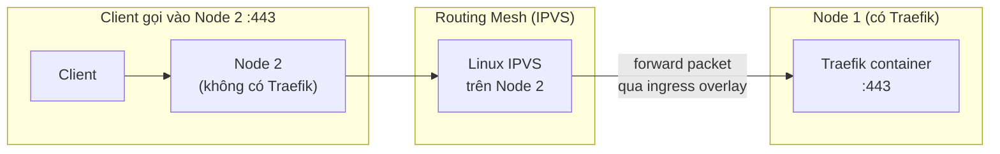
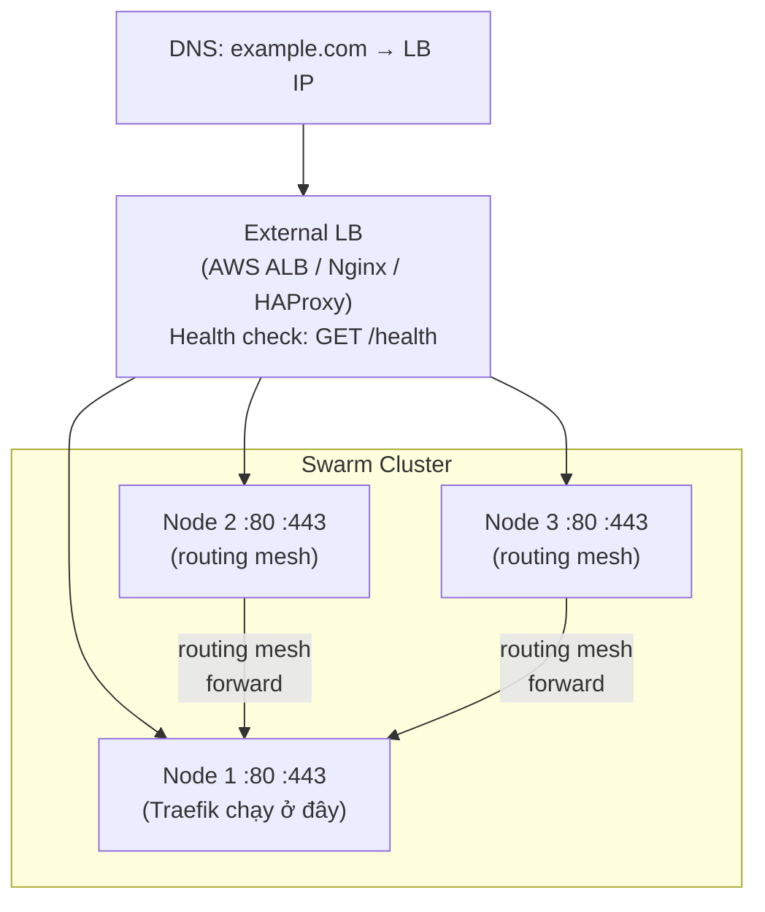

# Swarm — Ingress: Truy cập từ ngoài vào Cluster

> Mục tiêu: hiểu traffic từ internet đi vào service bên trong cluster như thế nào,  
> và cách setup Traefik làm reverse proxy / ingress giống K8s Ingress Controller.

---

## Vấn đề cần giải quyết

Khi có nhiều service trong cluster, bạn cần:

1. **1 điểm vào duy nhất** — không expose từng service ra port riêng
2. **Route theo domain/path** — `api.example.com` → service api, `app.example.com` → service web
3. **SSL termination** — HTTPS tại edge, nội bộ dùng HTTP
4. **Tự động** — thêm service mới không cần config thủ công

Routing mesh (built-in) giải quyết được #1 một phần nhưng không có #2, #3, #4.

---

## Kiến trúc tổng thể



**Luồng hoàn chỉnh:**
```
Client → DNS → (External LB) → Bất kỳ node nào :443
       → Routing Mesh → Traefik container
       → Traefik đọc Host header → route đến đúng service qua overlay network
       → Service container xử lý → response ngược lại
```

---

## Lớp 1: Routing Mesh — Chi tiết hơn



Routing mesh dùng **Linux IPVS** (kernel-level load balancer) — không phải userspace proxy, nên overhead rất thấp.

```bash
# Khi publish port, Docker tạo IPVS rule trên TẤT CẢ node
docker service create --publish 443:443 traefik:v3

# Kiểm tra trên bất kỳ node nào
sudo ipvsadm -Ln
# TCP  0.0.0.0:443 rr
#   -> 10.0.0.5:443  (Traefik container IP)
```

---

## Lớp 2: Traefik — Setup thực tế

### Tại sao Traefik?

- Tự động đọc Docker labels để tạo route — không cần restart khi thêm service mới
- Tích hợp Let's Encrypt tự động cấp và renew SSL
- Dashboard trực quan
- Native support cho Docker Swarm

### Cấu trúc label

```
traefik.enable=true
  → bật Traefik cho service này

traefik.http.routers.<name>.rule=Host(`api.example.com`)
  → traffic đến domain này...

traefik.http.services.<name>.loadbalancer.server.port=3000
  → ...forward đến port 3000 của container
```

---

## Ví dụ 1: Setup Traefik cơ bản (HTTP only)

```yaml
# compose.yaml

services:
  traefik:
    image: traefik:v3
    command:
      - --providers.swarm=true                        # dùng Swarm mode
      - --providers.swarm.exposedByDefault=false      # service phải opt-in bằng label
      - --entrypoints.web.address=:80                 # lắng nghe port 80
      - --api.dashboard=true                          # bật dashboard
      - --api.insecure=true                           # dashboard không cần auth (chỉ dùng khi dev)
    ports:
      - "80:80"
      - "8080:8080"       # Traefik dashboard
    volumes:
      - /var/run/docker.sock:/var/run/docker.sock:ro  # đọc Docker API để tự discover service
    networks:
      - proxy
    deploy:
      replicas: 1
      placement:
        constraints:
          - node.role == manager   # cần trên manager để đọc Docker API
      labels:
        - "traefik.enable=true"
        - "traefik.http.routers.dashboard.rule=Host(`traefik.example.com`)"
        - "traefik.http.routers.dashboard.service=api@internal"

  web:
    image: nginx:alpine
    networks:
      - proxy
    deploy:
      replicas: 3
      labels:
        - "traefik.enable=true"
        - "traefik.http.routers.web.rule=Host(`app.example.com`)"
        - "traefik.http.services.web.loadbalancer.server.port=80"

  api:
    image: myapp-api:latest
    networks:
      - proxy
    deploy:
      replicas: 2
      labels:
        - "traefik.enable=true"
        - "traefik.http.routers.api.rule=Host(`api.example.com`)"
        - "traefik.http.services.api.loadbalancer.server.port=3000"

networks:
  proxy:
    driver: overlay
```

```bash
docker stack deploy -c compose.yaml myapp

# Truy cập:
# http://app.example.com  → nginx
# http://api.example.com  → api
# http://<node-ip>:8080   → Traefik dashboard
```

---

## Ví dụ 2: Setup đầy đủ với HTTPS + Let's Encrypt

```yaml
# compose.prod.yaml

services:
  traefik:
    image: traefik:v3
    command:
      - --providers.swarm=true
      - --providers.swarm.exposedByDefault=false
      - --providers.swarm.network=proxy              # overlay network Traefik dùng để reach service

      # Entrypoints
      - --entrypoints.web.address=:80
      - --entrypoints.websecure.address=:443

      # Redirect HTTP → HTTPS
      - --entrypoints.web.http.redirections.entrypoint.to=websecure
      - --entrypoints.web.http.redirections.entrypoint.scheme=https

      # Let's Encrypt
      - --certificatesresolvers.letsencrypt.acme.email=admin@example.com
      - --certificatesresolvers.letsencrypt.acme.storage=/certs/acme.json
      - --certificatesresolvers.letsencrypt.acme.tlschallenge=true  # TLS-ALPN-01 challenge

      # Logging
      - --log.level=INFO
      - --accesslog=true
    ports:
      - "80:80"
      - "443:443"
    volumes:
      - /var/run/docker.sock:/var/run/docker.sock:ro
      - traefik_certs:/certs    # lưu cert Let's Encrypt
    networks:
      - proxy
    deploy:
      replicas: 1
      placement:
        constraints:
          - node.role == manager

  api:
    image: myapp-api:latest
    networks:
      - proxy
      - internal        # network riêng để nói chuyện với DB
    deploy:
      replicas: 3
      update_config:
        parallelism: 1
        delay: 10s
        order: start-first
        failure_action: rollback
      labels:
        - "traefik.enable=true"
        # Router
        - "traefik.http.routers.api.rule=Host(`api.example.com`)"
        - "traefik.http.routers.api.entrypoints=websecure"     # chỉ nhận HTTPS
        - "traefik.http.routers.api.tls.certresolver=letsencrypt"
        # Service
        - "traefik.http.services.api.loadbalancer.server.port=3000"
        # Health check cho load balancer
        - "traefik.http.services.api.loadbalancer.healthcheck.path=/health"
        - "traefik.http.services.api.loadbalancer.healthcheck.interval=10s"

  web:
    image: myapp-web:latest
    networks:
      - proxy
    deploy:
      replicas: 2
      labels:
        - "traefik.enable=true"
        - "traefik.http.routers.web.rule=Host(`app.example.com`)"
        - "traefik.http.routers.web.entrypoints=websecure"
        - "traefik.http.routers.web.tls.certresolver=letsencrypt"
        - "traefik.http.services.web.loadbalancer.server.port=80"

  db:
    image: postgres:16-alpine
    networks:
      - internal        # chỉ trong internal network, không qua proxy
    environment:
      POSTGRES_PASSWORD_FILE: /run/secrets/db_password
    secrets:
      - db_password
    volumes:
      - pgdata:/var/lib/postgresql/data
    deploy:
      replicas: 1
      placement:
        constraints:
          - node.role == manager

secrets:
  db_password:
    external: true

volumes:
  pgdata:
  traefik_certs:        # volume lưu SSL cert (cần persistent)

networks:
  proxy:
    driver: overlay     # Traefik ↔ web/api
  internal:
    driver: overlay     # api ↔ db (private)
    driver_opts:
      encrypted: "true"
```

```bash
# Deploy
printf 'DBpassword123!' | docker secret create db_password -
docker stack deploy -c compose.prod.yaml myapp

# Kiểm tra cert được cấp
docker service logs myapp_traefik | grep -i "certificate"
# Traefik tự request cert từ Let's Encrypt, lưu vào /certs/acme.json
```

---

## Ví dụ 3: Path-based routing (nhiều service dưới 1 domain)

```yaml
# Tất cả đi qua app.example.com, phân biệt bằng path
deploy:
  labels:
    # app.example.com/api/* → api service
    - "traefik.http.routers.api.rule=Host(`app.example.com`) && PathPrefix(`/api`)"
    - "traefik.http.services.api.loadbalancer.server.port=3000"

    # app.example.com/* → web service
    - "traefik.http.routers.web.rule=Host(`app.example.com`)"
    - "traefik.http.services.web.loadbalancer.server.port=80"
```

> ⚠️ Khi có nhiều router match, Traefik chọn rule **cụ thể hơn** — `/api` sẽ thắng `/`.

---

## External Load Balancer (tùy chọn)

Nếu cluster có nhiều node, nên đặt 1 LB bên ngoài để:
- DNS trỏ vào 1 địa chỉ duy nhất (không phải IP từng node)
- Tự loại node lỗi ra khỏi rotation
- Phân tải vào nhiều node



Khi node lỗi, LB ngừng gửi traffic vào node đó. Routing mesh vẫn hoạt động như backup kể cả không có external LB.

### Nginx làm external LB (ví dụ)

```nginx
# /etc/nginx/conf.d/swarm.conf — chạy trên VPS riêng ngoài cluster

upstream swarm_nodes {
    server node1.example.com:443;
    server node2.example.com:443;
    server node3.example.com:443;
}

server {
    listen 80;
    server_name *.example.com;
    return 301 https://$host$request_uri;
}

server {
    listen 443 ssl;
    server_name *.example.com;

    # SSL cert ở đây là wildcard cert — Traefik bên trong xử lý cert riêng
    ssl_certificate     /etc/ssl/certs/wildcard.crt;
    ssl_certificate_key /etc/ssl/private/wildcard.key;

    location / {
        proxy_pass https://swarm_nodes;
        proxy_set_header Host $host;
        proxy_set_header X-Real-IP $remote_addr;
        proxy_set_header X-Forwarded-For $proxy_add_x_forwarded_for;
        proxy_set_header X-Forwarded-Proto $scheme;
    }
}
```

---

## Swarm Ingress vs K8s Ingress

| | K8s Ingress | Swarm + Traefik |
|--|-------------|-----------------|
| Config bằng | Ingress YAML resource | Docker labels trên service |
| Auto discover | Có (watch Ingress objects) | Có (watch Docker API) |
| SSL | cert-manager + Ingress annotation | Traefik + Let's Encrypt built-in |
| Deploy ingress controller | Helm chart riêng | Service trong stack |
| Độ phức tạp | Cao hơn | Đơn giản hơn |

---

## Troubleshooting

```bash
# Traefik không nhận service mới
# → Kiểm tra label có đúng không
docker service inspect myapp_api --pretty | grep Labels -A 20

# Service bị 404 từ Traefik
# → Mở dashboard xem router có được tạo không
# http://<node-ip>:8080/dashboard/

# SSL cert không được cấp
docker service logs myapp_traefik | grep -i "acme\|cert\|error"
# Lý do phổ biến: domain chưa trỏ DNS đúng, port 443 chưa mở firewall

# Traefik không reach được service
# → Kiểm tra service có cùng network với Traefik không
docker network inspect proxy | grep -A 5 "Containers"
```

---

## Tóm tắt pattern chuẩn

```
Internet
  → DNS (trỏ vào IP node hoặc external LB)
    → Routing Mesh (mọi node :80/:443)
      → Traefik (1 service trên manager, đọc Docker labels)
        → Service A / B / C (chỉ trong overlay network, không publish port)
```

**3 nguyên tắc:**
1. Chỉ **Traefik** publish port 80/443 ra ngoài
2. Các service khác **không publish port** — dùng overlay network nội bộ
3. DB và service nhạy cảm nằm trong **network riêng** (internal), không đi qua proxy network

---

**Xem lại:** [07-production.md](07-production.md) có ví dụ compose.yaml với Traefik labels trong production stack.
